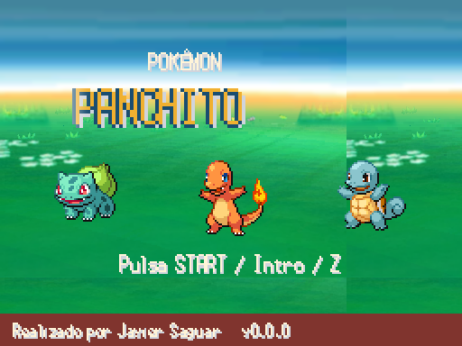
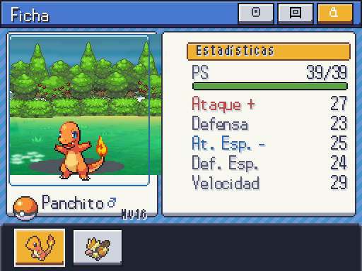

# Accesibilidad (2026-10-07)

| Movimiento normal | Reducido |
| --- | --- |
|  |  |
| Evolución con destellos | Evolución estática: A para evolucionar, B para detener |
| Eclosión con sacudidas/grietas | Cría presentada inmediatamente, mismo resultado |
| Barras de PS/experiencia interpoladas | Valores finales inmediatos |
| Naturaleza solo en rojo/azul |  |

Reducción aplicada al título/parallax/logo, créditos automáticos (sigue el desplazamiento manual), puntos de generación, cursores, iconos, reposo de sprites, botones, barras, entrada/movimientos/captura/shiny/transformaciones de combate, evolución y eclosión. Conserva velocidad de texto elegida, mensajes, avisos de estado y decisiones. Indicadores de combate M/Z/MAX/T y estados escritos; naturaleza en estadísticas además muestra +/-, y no depende solo de rojo/azul. Capturas a 512×384; textos largos de detalle recorribles, sin depender de ratón.

Tests de mando A/B en evolución y mecánicas, cancelación reducida sin cambiar especie y presentación de eclosión sin modificar el resultado. PENDIENTE JAVIER: revisión visual final del conjunto.
