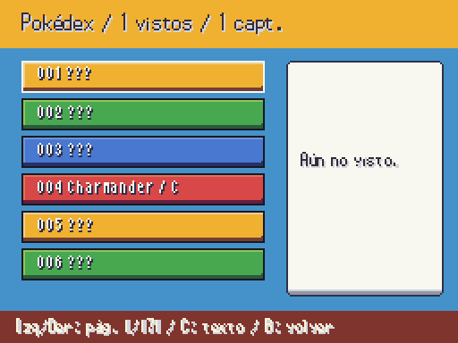
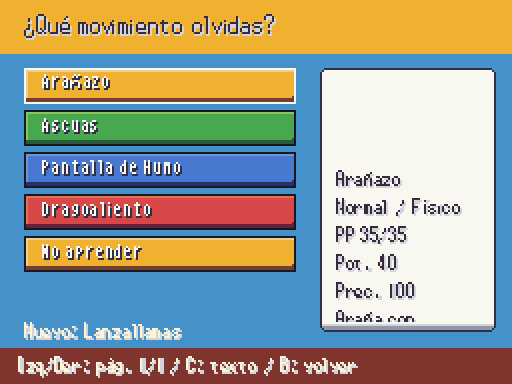
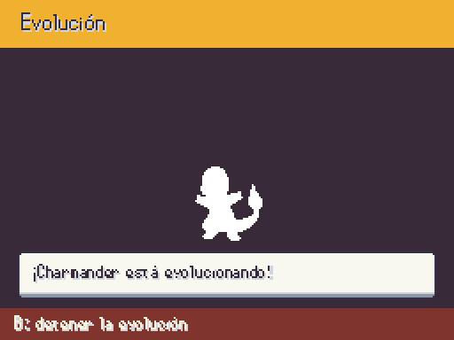
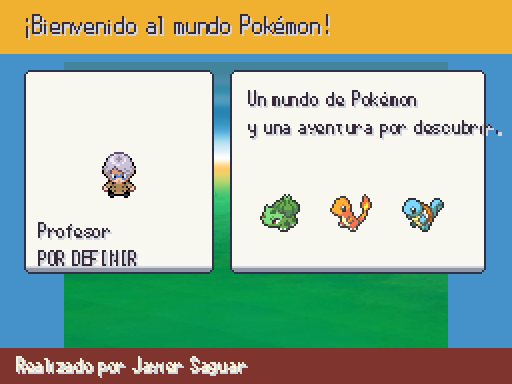

# Pokédex, evolución, aprendizaje e intro — A3, 2026-10-06

Antes no había pantallas para la Pokédex ni la evolución; el aprendizaje mostraba solo nombres en la lista de combate y la intro era diálogo sobre el mapa. Las capturas de ahora proceden del juego a 512×384 con una partida temporal; fuentes y marcos propios, sprites del pack a tamaño nativo.

| Lista de Pokédex | Entrada registrada |
|---|---|
|  |  |

No se revela el nombre ni el icono de una especie sin ver; la descripción requiere captura. Se usa el orden nacional mientras Javier no decida la regional. C/Start recorre descripciones largas sin dibujar fuera del marco.

| Aprendizaje (antes: solo nombres) | Evolución (antes: pendiente sin presentación) |
|---|---|
|  |  |

El aprendizaje enseña PP, tipo, categoría, potencia, precisión y descripción; confirma la sustitución y devuelve un índice al motor. La evolución alterna siluetas blancas de los sprites originales sin escalarlos ni rotarlos; B la detiene por nivel. Con piedra no se cancela y se consume una vez tras aplicarse. La escena encuentra el Pokémon por UID, registra la Dex y conserva mote/daño. Shedinja extra funciona en Normal con hueco y Ball; la regla de recepción del extra en Locke está en la pregunta 28.

| Antes: intro sobre el mapa | Presentación usando arte publicado |
|---|---|
|  |  |

El guion y los nombres siguen en MvpStory/WorldNames. Se muestra el personaje del profesor publicado: el retrato de combate definitivo pertenece a A4 y sigue pendiente, al igual que los nombres e iniciales definitivos. La escena lee los iniciales reales de DataDB, también con parche RandomLocke.
