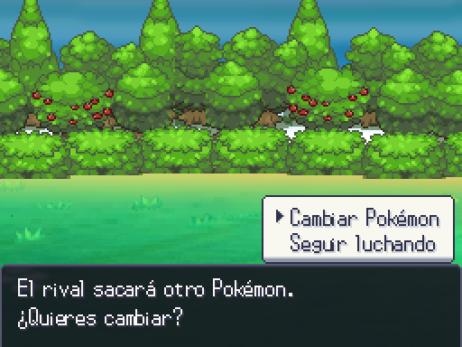
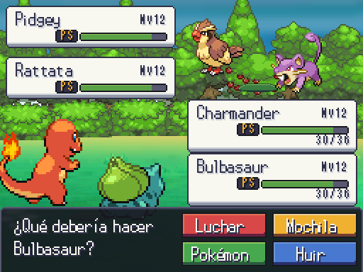
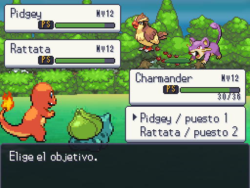

# Combate doble (2026-10-07)

Cuatro sprites a tamaño nativo y cuatro cajas independientes. El menú repite la petición del motor para los puestos 1 y 2; selección de rival solo para ataques de objetivo individual. Los movimientos de área, propio usuario o aliado conservan el destino automático del motor. Todos los eventos se dirigen por bando y puesto; un KO no oculta al compañero.

| Antes | Ahora |
| --- | --- |
|  |  |
| Objetivo único |  |

Pareja de TrainerNPC: un solo BattleSetup doble, ambos entrenadores/equipos, sus dos flags al ganar. Opciones generales del entrenador que inicia y nivel de IA máximo de ambos. No se incorporan nuevas parejas al mundo sin el guion aprobado. Las bases/fondos publicados siguen pendientes del arte de A4; no se modifican ni reescalan sprites para encajarlos.

PENDIENTE JAVIER: aprobación visual de la disposición a 512×384.
