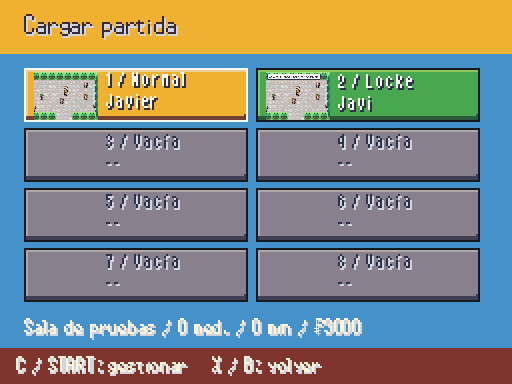

# Ranuras y pausa · A3 · 2026-10-06

| Pausa provisional de A1 | Pausa propia |
|---|---|
|  |  |

Ocho tarjetas por página con miniatura real, nombre y modo. Resumen de ubicación, medallas, tiempo y dinero de la selección. Las vacías y las Locke finalizadas no se cargan. Elegir para partida nueva/guardar confirma sobrescrituras. C/Start abre la gestión: copiar (confirmación del destino ocupado), borrar (dos confirmaciones), y páginas si se configuran más de ocho ranuras. X/B vuelve; cancelar una copia abandona su destino.

La pantalla elige la ranura y usa SaveManager: no altera el estado al copiar/borrar. La pausa mantiene su bloqueo al abrir subpantallas; Guardar permite elegir ranura, Cargar completa la transición desde UiRuntime, que sigue vivo al retirar la pausa. El indicador de zona se oculta en menús/nombres y vuelve al mundo sin tapar cabeceras.

Las demás opciones de pausa se habilitan según llegan sus pantallas en las siguientes entregas de la tarea 3/7; no se muestran sustitutos nuevos. Capturas reales con `tools/arte/capture_ui.gd -- --screen=slots` o `pause`. Miniaturas de partidas normal y RandomLocke realmente generadas/guardadas, en un directorio temporal propio del proceso de captura.

Pruebas: copia cancelada y aceptada sobre una partida existente sin modificar la que está en curso; borrado cancelado en la segunda confirmación y luego aceptado; tarjetas vacías; guardar, continuar y devolver control con la pausa real.

Validación: 318/318 tests tras integrar Mega de A2, 3828 aserciones, 86,3 s; arte 10521 PNG con 0 errores/0 avisos. Incluye rechazo de selección de Locke terminada y comprobación de que ambas líneas caben en cada tarjeta.

Tras incorporar movimientos Z de A2: flujo 9/9, ranuras 4/4 y BattleScene 11/11 (114 aserciones); validador nuevamente limpio.
