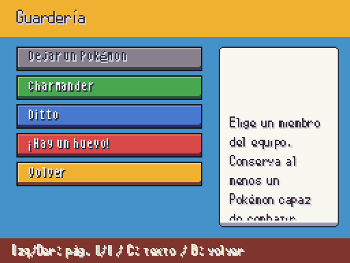
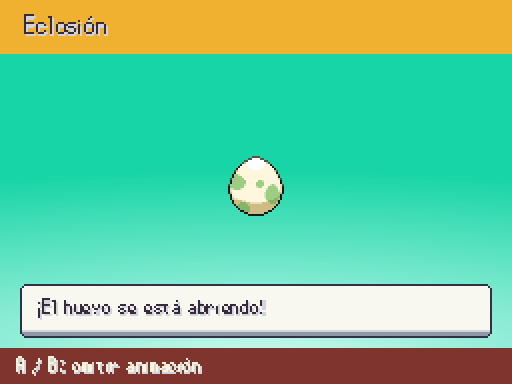
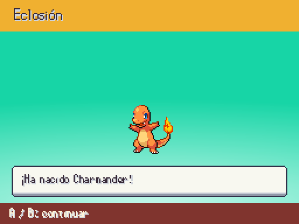

# Guardería y eclosión (2026-10-07)

| Antes | Ahora |
| --- | --- |
| Sin pantalla |  |
| Sin escena de eclosión |  |
| Sin presentación de cría |  |

Eggs/000 y sus cinco cuadros de grietas del pack 06 y fondo EBDX Hatching, originales a tamaño nativo. La escena no altera equipo, Pokédex ni la cría recibida. A/B omiten animación, sin cancelar la eclosión; la reducción omite sacudidas y grietas. Se conservan música y controles al volver.

DaycareScreen usa el Daycare recibido por el llamador. Traslados atómicos, último Pokémon capaz protegido y equipo lleno sin retirar. El aviso lee egg_ready. Pedir huevo devuelve true sin consumirlo: el dueño del estado debe crear/guardar el huevo y decidir cuándo presentar la eclosión.

**Integración persistente bloqueada por petición 66**: API actual sin guardado de plazas/RNG, estado de huevo ni pasos de eclosión en GameState. No se añade una entrada de producción que pudiera perder Pokémon al cargar ni se transforma take_egg() en una eclosión instantánea. PENDIENTE JAVIER: aprobación visual; ubicación de la guardería cuando se defina el mundo.
