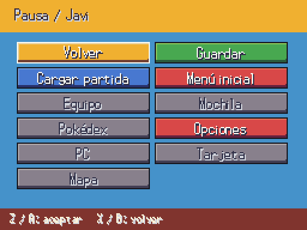
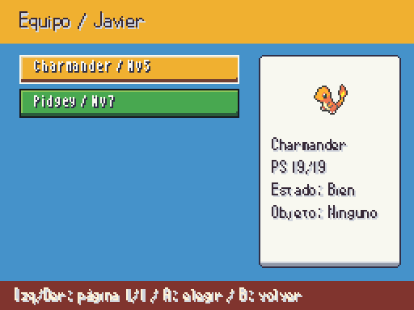
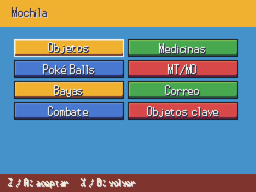
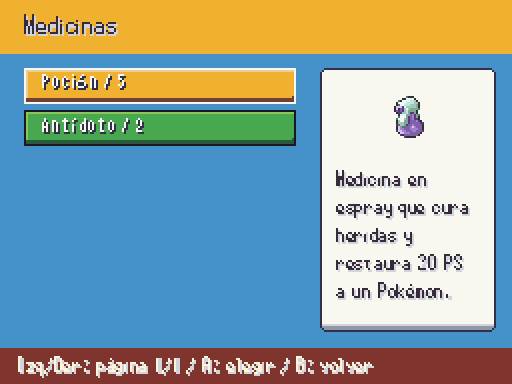
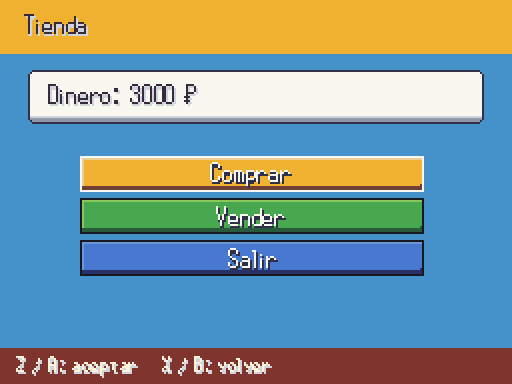
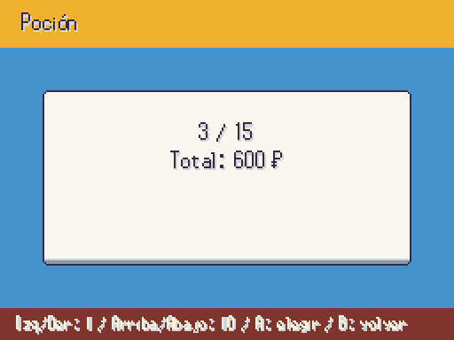

# Equipo, mochila y tienda — A3, 2026-10-06

Antes, las opciones de pausa estaban desactivadas y el dependiente solo podía abrir el contrato previsto. Ahora abren pantallas del juego. UI propia reutiliza los marcos dibujados a mano; iconos de Pokémon y objetos del pack 06 a tamaño nativo. Capturas del ejecutable a 512×384, datos temporales aislados.

| Antes | Equipo |
|---|---|
|  |  |

| Bolsillos | Objetos y descripción |
|---|---|
|  |  |

| Tienda | Cantidad y precio |
|---|---|
|  |  |

Equipo: Datos abre la ficha existente; Mover elige una posición; Dar y Quitar intercambian objetos conservando cantidades. El selector muestra especie, PS, estado y objeto, con icono animado. Acciones de campo lee FieldActions y no crea requisitos de historia.

Mochila: ocho bolsillos, descripción/icono, usar/dar/tirar con cantidad y confirmación; objetos clave protegidos. PS/estado/revivir/PP/repelente consumen una unidad solo al aplicarse. La Cuerda Huida necesita datos de destino; MT y otros efectos fuera del stock MVP esperan el contrato correspondiente.

Tienda: stock por medallas, precio especial si existe, selección de cantidad, total y confirmación. Comprar valida dinero y capacidad; vender valida cantidad, precio y máximo de dinero. Las operaciones rechazadas no mutan la partida. Pruebas con entrada de mando real para reordenación, paginación, cantidad y cierre.
