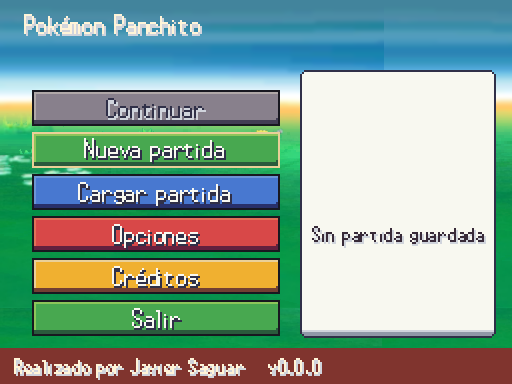
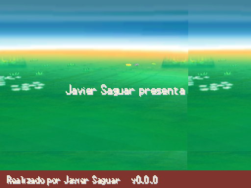
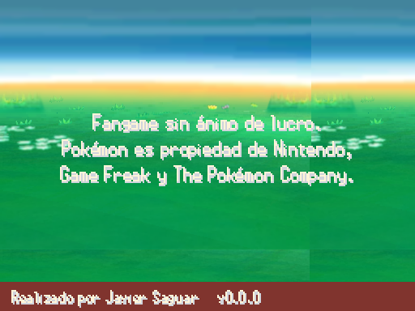
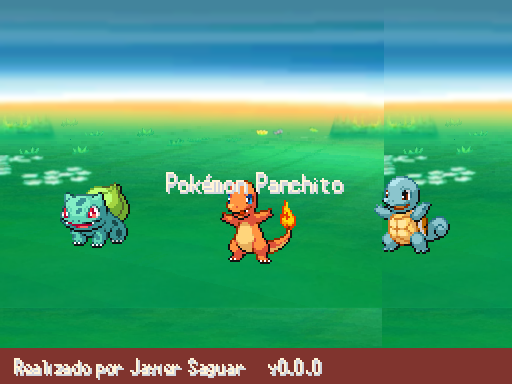
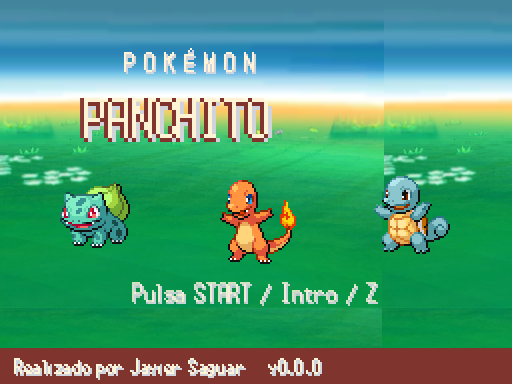
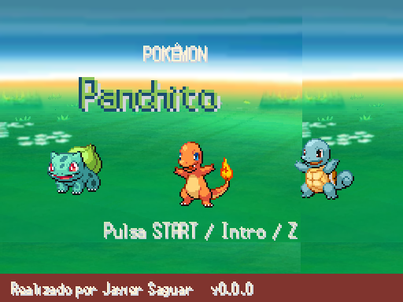
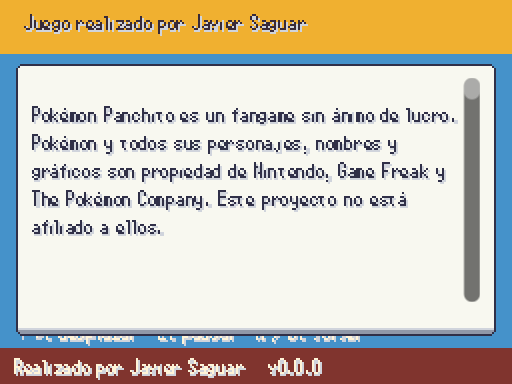

# Menú inicial · A3 · 2026-10-06

Antes: `flujo_menu_inicial.png`, diálogo provisional de A1. Ahora: pantalla propia, navegación con teclado/mando, nueva partida y carga por las APIs existentes. Continuar muestra resumen, modo y miniatura; se desactiva sin partida o con Locke terminada. Los créditos leen autores/licencias de CREDITOS.md y permiten desplazar o pausar.

| Antes | Después |
|---|---|
|  |  |

Arranque: splash no saltable la primera vez; aviso; intro de diez segundos saltable; título; menú. Demostración tras 45 s en el título. Pie de autor y versión del proyecto, también al abrir Opciones/Créditos. No se cambia artificialmente la versión del proyecto.

| Splash | Aviso | Intro |
|---|---|---|
|  |  |  |

## Propuestas de composición del logo, pendientes de Javier

Estas son composiciones tipográficas con la fuente existente, no la tipografía propia definitiva. A conserva amarillo/azul; B usa blanco/teja y una cabecera espaciada; C combina minúsculas y verde. El título tiene entrada de 0,25 s, oscilación de píxel entero y brillo que lo recorre. Tres capas del Field del pack ya acreditado, recortadas a escala nativa, con parallax; los sprites del pack tampoco se reescalan.

| A · Amarillo | B · Blanco/teja | C · Verde |
|---|---|---|
|  |  |  |

Reproducción: `godot --path . --rendering-method gl_compatibility --audio-driver Dummy -s tools/arte/capture_ui.gd -- --screen=title_0` (también title_1, title_2, main_menu, splash, notice, intro, credits).

Pendiente de Javier: identidad de Panchito/legendario de portada y composición/tipografía definitiva (preguntas 5 y 27). La intro usa el trío provisional existente, no añade historia. Música de título/intro/créditos pendiente de elegir recurso; la tarea 4 propone candidatos. La carga/elegir ranura y el modo aún usan los sustitutos hasta las tareas 3 y 6.

Validación: importación sin errores; 300/300 tests, 3744 aserciones, 80,6 s; validador 10521 PNG, 0 errores/0 avisos. Transición de Continuar probada con partida real; Opciones vuelve al menú y conserva el pie.
