# Menú de pruebas — 2026-10-10

Decisión de Javier: **F9, solo debug; sesión independiente; todo lo jugable de forma continua**. El menú abre en la pestaña **Pruebas**. **Entrar** crea una aventura temporal en San Miguel; **Salir de pruebas** recupera la partida anterior, incluidos los cambios sin guardar, su ranura y su ROM. Si se abrió desde el título, vuelve al título. F9 cierra y abre el menú sin terminar la sesión.

| F9 anterior | Menú jugable nuevo |
|---|---|
| 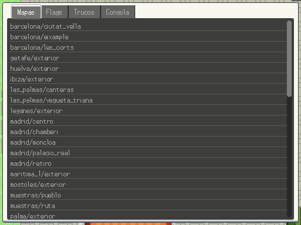 | 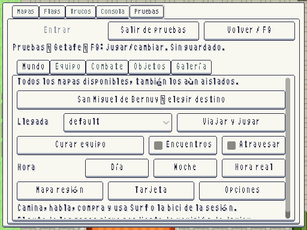 |
| 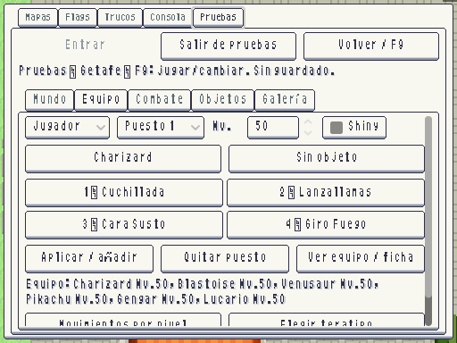 | 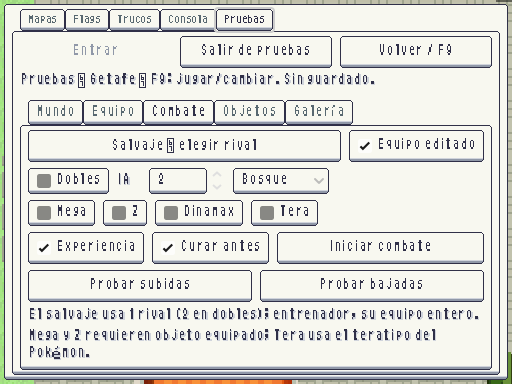 |
| 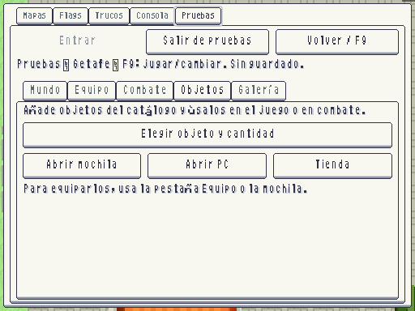 | 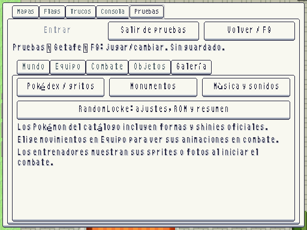 |

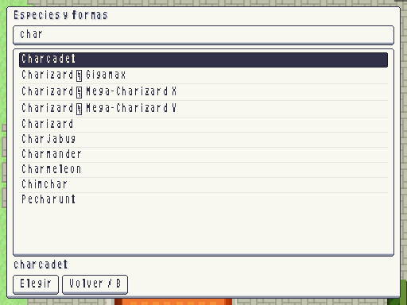

## Recorrido de revisión

1. Ejecutar una build de debug, pulsar **F9 → Pruebas → Entrar**. Se prepara un equipo de seis, objetos, transporte y dinero de pruebas. Los encuentros empiezan apagados; se activan en Mundo.
2. **Mundo:** elegir ciudad/ruta/sala y llegada; **Viajar y jugar** devuelve el control. Las conexiones, diálogos, compras y encuentros existentes siguen funcionando. También se puede saltar a los tramos que aún no tienen conexión con San Miguel. Hora, curación y atravesar paredes solo afectan a la sesión.
3. **Equipo:** jugador/rival, puesto 1–6, especie o forma, nivel, shiny oficial, cuatro movimientos y objeto equipado. **Aplicar / añadir** confirma el borrador; se añaden puestos contiguos y no se elimina el último miembro. La ficha y el equipo son las pantallas reales.
4. **Combate:** rival salvaje o cualquier entrenador de los datos; equipo original del entrenador o editado; simples/dobles, IA, entorno, experiencia y curación. Activar Mega/Z/Dinamax/Tera permite las mecánicas reales: Mega y Z siguen necesitando el objeto equipado correspondiente. En dobles hacen falta dos miembros aptos. Al acabar se vuelve al mapa; el equipo mantiene lo ocurrido y se puede curar para repetir.
5. **Objetos:** catálogo completo, cantidades, mochila, PC y tiendas reales. **Galería:** Pokédex completa para revisar sprites/shinies/gritos, monumentos a tamaño nativo, música/sonidos y pantallas de ajustes/generación/resumen de RandomLocke. Confirmar la ROM inicia el flujo real dentro de la sesión temporal.
6. **Salir de pruebas:** termina cualquier diálogo, menú o combate antes de restaurar. Las ranuras y el índice de Continuar están protegidos en todas las entradas de SaveManager, también desde pausa/consola. Las preferencias probadas no se escriben en ui.cfg y se recuperan al salir.

## Subidas y bajadas de estadísticas

| Antes: destello igual en ambas direcciones | Ahora: subida |
|---|---|
| 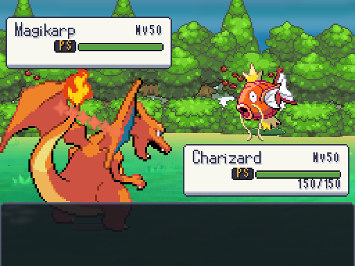 | 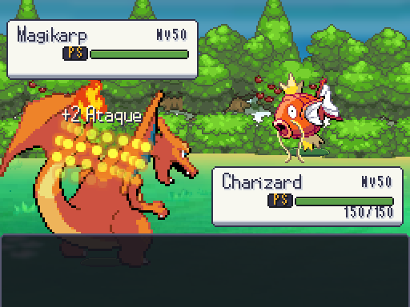 |

| Bajada | Reducir animaciones |
|---|---|
| 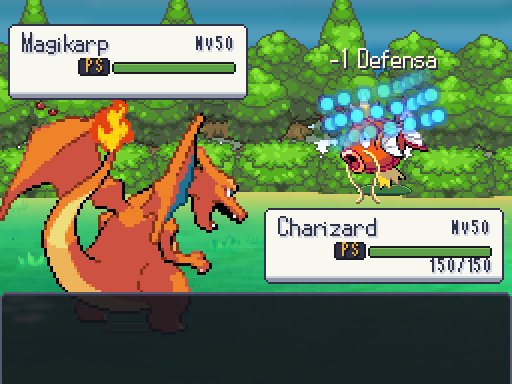 | 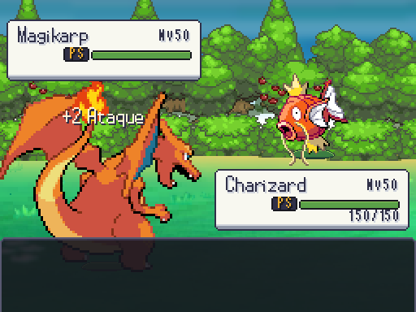 |

Partícula **original de EBDX**, sin generar dibujos, rotar ni escalar. Oleadas naranjas hacia arriba o azules hacia abajo, intensidad según magnitud, sonido existente y nombre/signo del cambio. Usa la casilla y el bando del evento del motor, incluidos dobles. **Probar subidas / Probar bajadas** preparan movimientos de estadísticas contra Magikarp con Salpicadura: elegir Luchar para revisarlos, Huir para volver al mapa. La reducción mantiene el rótulo sin desplazamientos ni partículas.

## Límites del contenido actual

El menú enseña lo implementado; no completa edificios, personajes ni efectos pendientes. Los monumentos/mapas siguen **PROVISIONALES, pendientes Javier**. Algunos movimientos aún usan efectos generales o carecen de su efecto de motor específico; hay gritos que faltan y la Pokédex regional sigue por decidir (avisos previos del validador de datos). Los interiores y enlaces que todavía no existen no aparecen como destinos. El menú y las animaciones nuevas quedan pendientes de aprobación visual.

Capturas reales de 512×384 mediante `tools/arte/capture_ui.gd -- --screen=playtest_world` (equipo: `playtest_team`; combate: `playtest_battle`; demás sufijos homónimos) y `stat_before/stat_up/stat_down/stat_reduced`. Archivos de pruebas aislados con XDG_DATA_HOME.

Validación final: **471/471 tests**, 18.027 aserciones, 411,76 s; validador de arte **10.906 PNG, 0 errores/avisos**; datos **0 errores, 3 avisos previos**. Pruebas nuevas de restauración sin guardar, ranuras intactas, ROM/reglas, estilos por partida, edición y eventos del motor, viajes reales, F9, sesión única y formas distinguibles; animaciones con signo/dirección y reducción.
