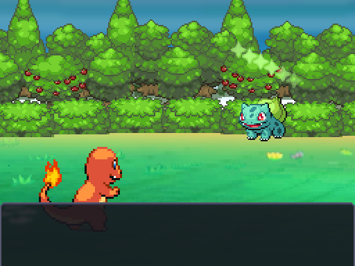

# Movimientos genéricos: gráficos originales de NikDie

| Antes | Después |
|---|---|
| Círculos y rectángulos dibujados en `BattleFx` | Cuadros originales, sin alterar PNG, escala nativa y posiciones enteras |
| Impacto físico por color |  |
| Proyectil especial por color |  |
| Destellos de estado por color |  |

La comparación anterior también está en `combate_lado_a_lado.png`. Las tres capturas nuevas usan la misma escena y Pokémon. `data/battle_motion_types.json` cubre los 18 tipos; una animación genérica dura 0,65 s y el físico conserva el acercamiento del Pokémon. Cuadros de fuego 53×101, viento 64×128, metal 82×174 e impacto 64×64 comprobados en las referencias Ruby. Sin rotación ni escalado continuo. No se copia el código de RPG Maker: se adapta la presentación al contrato de Godot. Destellos de estado usan la estrella original de Moonblast, coloreada por tipo.

Créditos: NikDie y Luka S.J., más los autores de EBDX indicados en `CREDITOS.md`. Los originales y sus tamaños/hashes están en `data/battle_motion_assets.json`; importación reproducible con `tools/arte/import_battle_media.py`. Esto cubre las genéricas; las secuencias específicas del MVP son la siguiente entrega.
