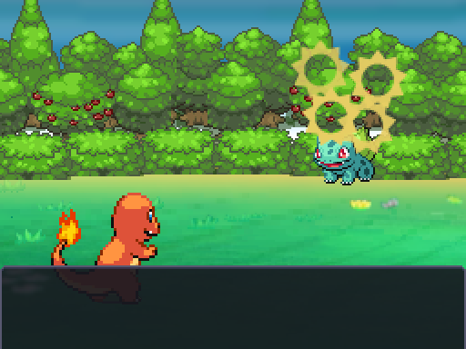
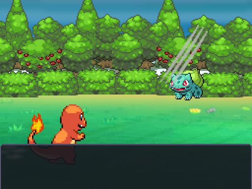
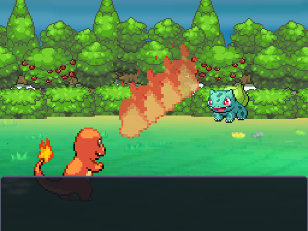
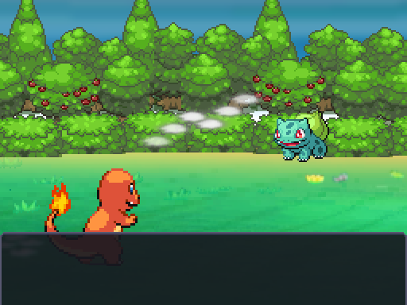
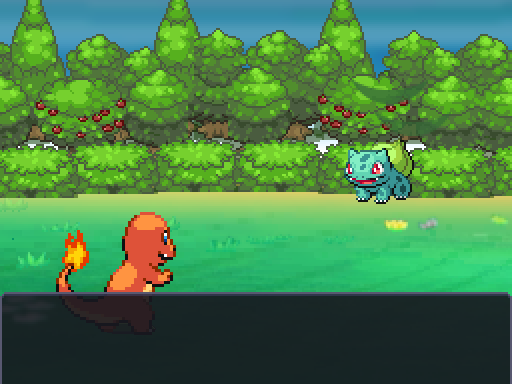

# Secuencias de movimientos del MVP

Cobertura calculada con `tools/arte/list_mvp_moves.gd`: equipos iniciales de entrenadores, iniciales y todos los niveles configurados de encuentros, regalos y estáticos (incluida la sala de pruebas). **16 movimientos**, con secuencia explícita. No incluye movimientos aprendidos después de esos niveles ni todos los que podría producir RandomLocke; estos usan las genéricas.

| Movimiento | Secuencia | Fuente original |
|---|---|---|
| Niebla Aromática | mist | `eb59_8.png` |
| Rizo Defensa | flash | `eb519_2.png` |
| Ascuas | orb | `eb136.png` |
| Gruñido | sway | `eb460.png` |
| Picotazo | lunge | `eb303_2.png` |
| Camaradería | sway | `eb519_2.png` |
| Picotazo Veneno | orb | `eb303_0_4.png` |
| Ataque Rápido | quick | `eb303_2.png` |
| Arañazo | lunge | `eb601.png` |
| Salpicadura | hop | `eb519_2.png` |
| Disparo Demora | jet | `eb551_2.png` |
| Dulce Aroma | petals | `eb611_2.png` |
| Placaje | lunge | `eb303.png` |
| Agitacola | sway | `eb519_2.png` |
| Látigo Cepa | whip | `eb208.png` |
| Pistola Agua | jet | `eb551.png` |

| Genérica anterior | Específica |
|---|---|
|  |  |
|  |  |
|  |  |

Imágenes originales NikDie/EBDX con SHA-256, sin editar, rotar ni reescalar. Los Ruby de Scratch, Ember, Watergun, Spiderweb, Sweetscent, Tackle y Vinewhip sirven de referencia de los gráficos; Growl/Playnice, Tailwhip, Defensecurl, Splash y Quickattack se adaptan como movimiento/flash del sprite y efectos originales reutilizados. Aromaticmist no trae secuencia dedicada: usa la nube original, con desplazamiento y opacidad. No se representa como una copia exacta de los scripts Ruby. Los movimientos sin gráfico dedicado usan un gráfico existente adecuado, nunca un sprite generado por código. `fast` omite todas las secuencias; al acabar el sprite recupera su posición.
