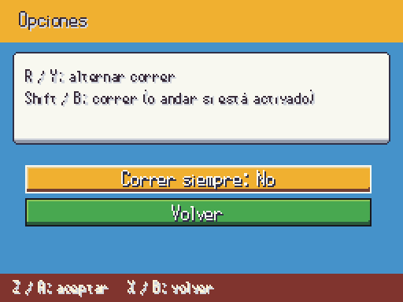
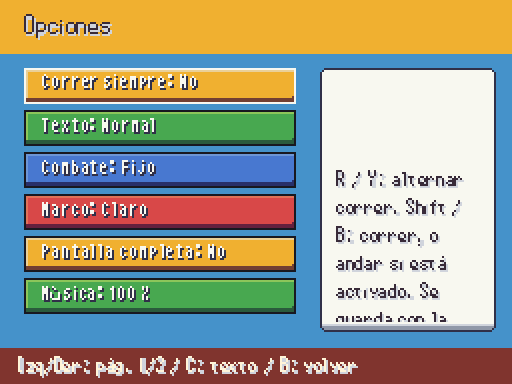
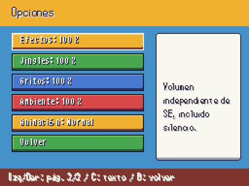
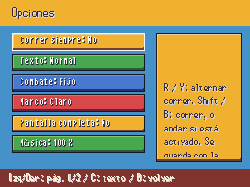
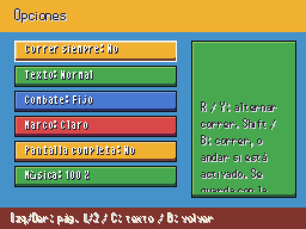

# Opciones completas (2026-10-07)

Pantallas reales a 512×384. Texturas de marcos ya publicadas, sin arte nuevo ni deformación. Navegación por páginas con izquierda/derecha y detalle con C/Start. Cada volumen permite silencio. Reducir animaciones conserva mensajes y reglas. Correr siempre sigue guardándose con la partida.

| Antes | Ahora |
| --- | --- |
|  |  |
| Solo correr |  |

| Marco amarillo | Marco verde |
| --- | --- |
|  |  |

PENDIENTE JAVIER: aprobación visual de estos marcos. Se ofrecen como variantes de los gráficos existentes. Correr siempre se refiere a la partida; el valor inicial sigue el ajuste de mundo publicado.
