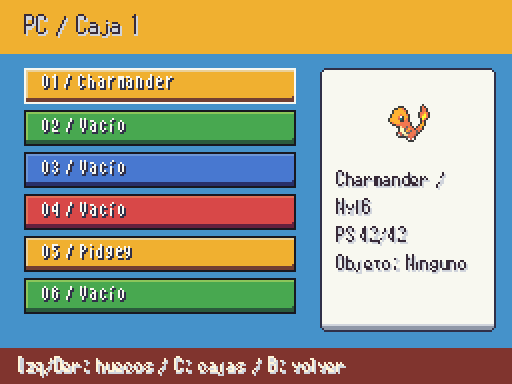
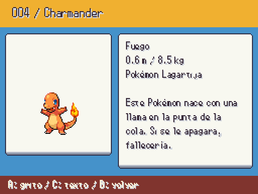
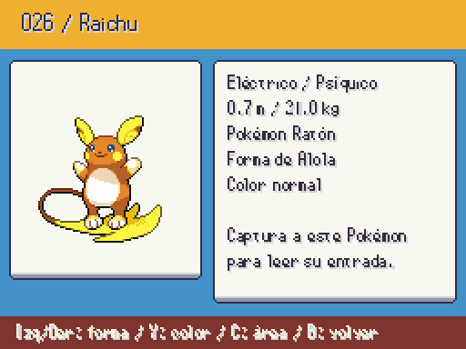
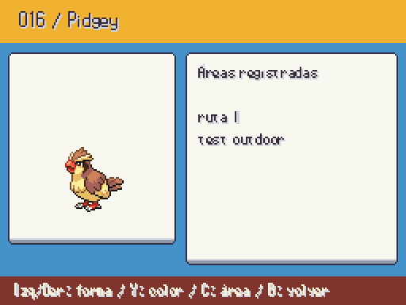
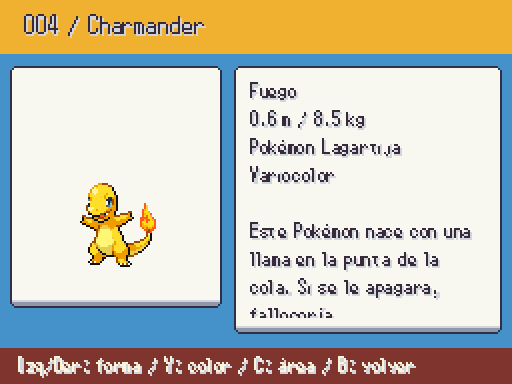
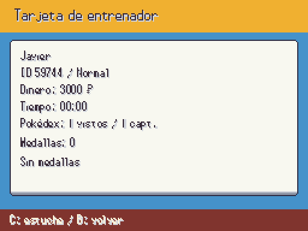
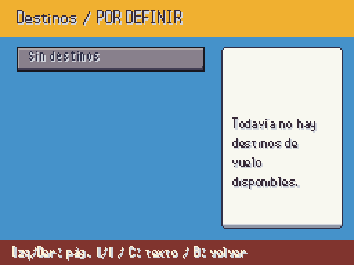

# PC, Pokédex, tarjeta y destinos (2026-10-07)

Pantallas reales a 512×384, con marcos publicados y sprites a tamaño nativo. El PC enumera los 30 huecos de cada caja en páginas de seis, conserva objetos y UID y protege al último capaz de combatir. Mover mantiene el origen hasta elegir el destino; B cancela sin sacar el Pokémon. Liberar exige doble confirmación.

| Antes | Ahora |
| --- | --- |
| PC desactivado en pausa |  |
|  |  |
| Solo datos básicos |  |
| Solo color normal |  |
| Tarjeta desactivada |  |
| Mapa desactivado |  |

PENDIENTE JAVIER: aprobación del PC de lista y de la tarjeta. El estuche muestra los registros guardados. **No se declara terminado el mapa regional gráfico ni las ocho medallas propias**: faltan diseño aprobado, nombres y gráficos; petición 65. La lista de vuelo usa WorldTravel.destinations()/fly(), sin inventar destinos ni coordenadas. La Pokédex muestra solo formas vistas; shiny usa la marca de especie base disponible en la API. Áreas por tablas activas, pendientes de representación sobre el dibujo regional.
