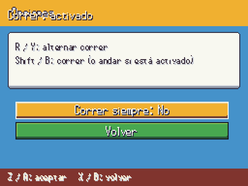
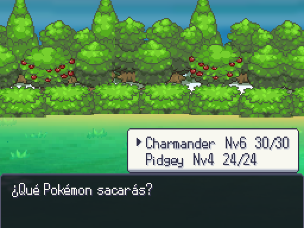

# A3 · Peticiones rápidas · 2026-10-06

Capturas reales de Godot 4.7.2, 512×384; `tools/arte/capture_ui.gd` reproduce cada pantalla. Sin modificar los sprites.

## Correr

Antes: R/Y alternaba el estado guardado, sin aviso ni opción visible. Ahora: Opciones permite cambiar **Correr siempre**, explica la inversión con Shift/B y muestra **Correr: activado/desactivado** durante dos segundos, sin bloquear al jugador. El menú de pausa provisional permite abrir Opciones.

| Opción | Aviso |
|---|---|
|  |  |

## Cambio

Izquierda: sustituto obligatorio por KO; no admite cancelar. Derecha: el modo Cambio ofrece seguir luchando; cancelar la pregunta o la selección envía `party_index=-1`. El motor decide si pide el cambio; el modo Fijo/Locke conserva su regla.

| Obligatorio | Opcional |
|---|---|
|  |  |

## Entrenadores

`assets/sprites/trainers/` se valida como pack de terceros: conserva sus colores originales, con control de tamaño 160×160 o cuadros 175×196. No se publica arte del Agente 4 desde esta tarea.

Validación: 296 tests, 3720 aserciones, 76,8 s; tras integrar la corrección de megas de A2: tests de arte 2/2; validador 10521 PNG, 0 errores, 0 avisos.
