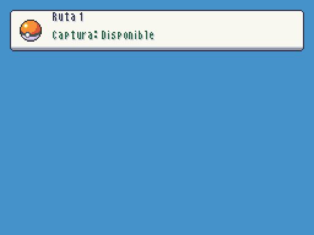
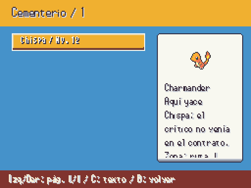
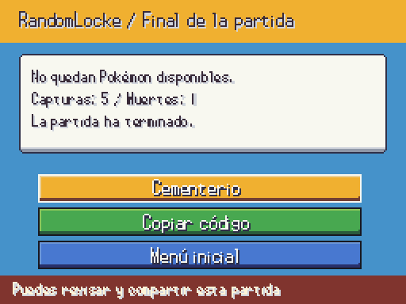
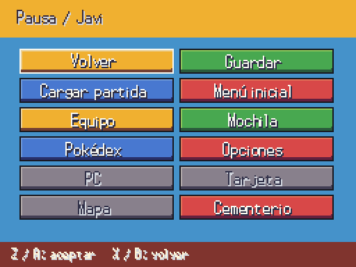

# Zona, Cementerio y final RandomLocke

| Antes | Después |
|---|---|
| Etiqueta provisional del mundo |  |
| Sin pantalla de Cementerio |  |
| Señal de fin sin presentación |  |
|  |  |

El indicador lee el estado real disponible/pendiente/capturada/perdida, y muestra «Sin límite» al desactivar la primera captura. Se oculta durante menús, nombres y el aviso de correr, y vuelve al cerrarlos. El Cementerio lee el snapshot de LockeRules, muestra icono, nombre/nivel, epitafio, zona y rival; C recorre detalles largos, A muestra el epitafio completo. No permite sacar Pokémon ni revivirlos. La nueva entrada de pausa solo se activa en RandomLocke.

Game over espera al cierre del combate, conserva el bloqueo del mundo y no admite volver con B. Guarda la ranura como terminada, permite ver Cementerio/copiar código y volver al título. Si falla el guardado, muestra el error y reintenta antes de salir. Test real crea ROM, termina partida y comprueba que la ranura sigue finalizada después de volver al título. Los gráficos son los iconos publicados; no se dibujan nuevos sprites. Capturas con datos de muestra señalados como prueba, sin modificar guardados reales.
