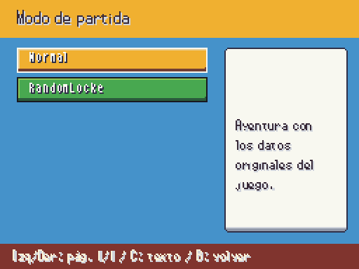
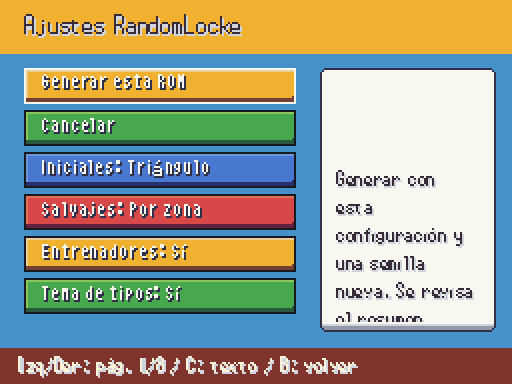
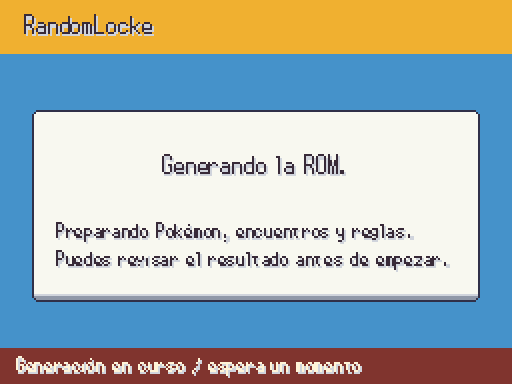
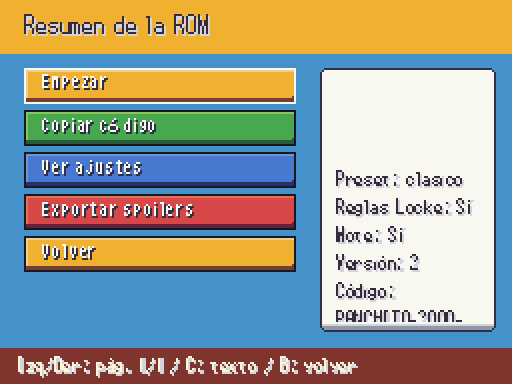

# Nueva partida RandomLocke

| Antes | Después |
|---|---|
| Sustituto de A1: preguntas en Dialogue |  |
| Personalizar en cuatro filas y «Otra página» |  |
| Aviso provisional de generación |  |
| Pregunta de semilla y páginas de diálogo |  |

Todas las pantallas usan el Theme y botones existentes, teclado/mando y el lienzo lógico 256×192. Izquierda/derecha recorren páginas, C recorre el texto; los nombres largos se abrevian en la lista y se muestran completos en el detalle. Se conservan los campos, rangos, presets y API del motor A2 (§10), sin alterar la generación. La entrada de código usa el teclado A3, incluido pegar con teclado físico. Se valida la versión antes de generar. La ROM no se aplica al cancelar: primero se confirma el resumen, que no muestra especies.

El código se copia completo con «Copiar código»; su texto largo está dividido en líneas solo para leerlo, no para compartirlo. «Exportar spoilers» solicita confirmación y escribe `user://randomlocke_spoilers.txt`. La generación usa RandomlockeJob con snapshot y un hilo; no se inventa un porcentaje ni se bloquea el mundo con trabajo pesado en el hilo principal. El resumen y presets usan datos del motor; cualquier especie puede salir según ajustes/prohibidos, sin restricción por sprites.
