# Comparativa del repaso de interfaz — 2026-10-07

Pantallas reales a 512×384. Se conservan las capturas anteriores y se guardan las de esta sesión en una carpeta separada. [Informe de defectos y pruebas](../repaso_interfaz.md).

| Antes | Ahora |
| --- | --- |
| 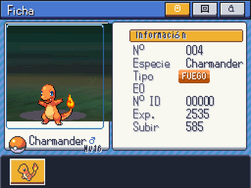 | 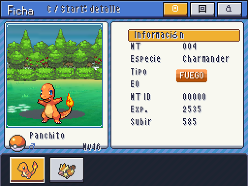 |
| Sin lista de movimientos en ficha | 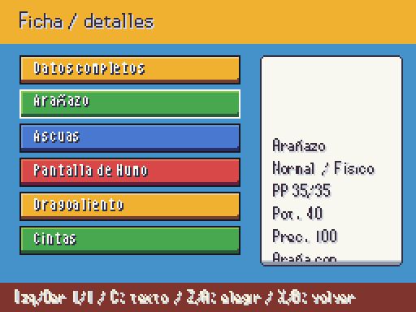 |
|  | 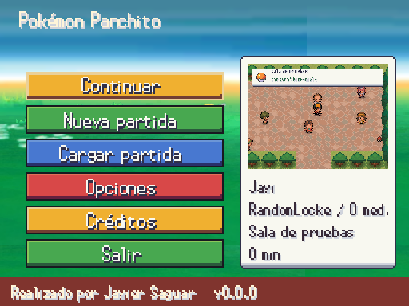 |
|  | 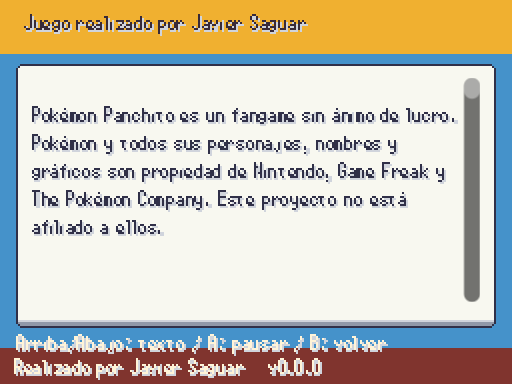 |
|  | 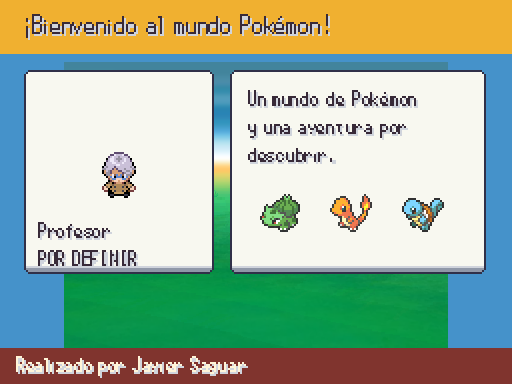 |
|  | 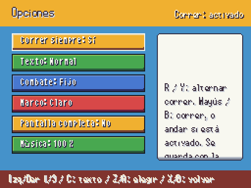 |
| Sin consulta de controles | 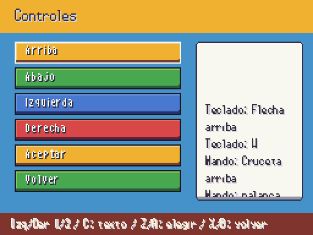 |
| MT sin uso en mochila | 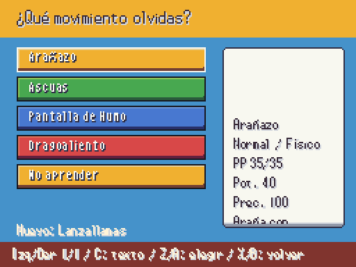 |
| 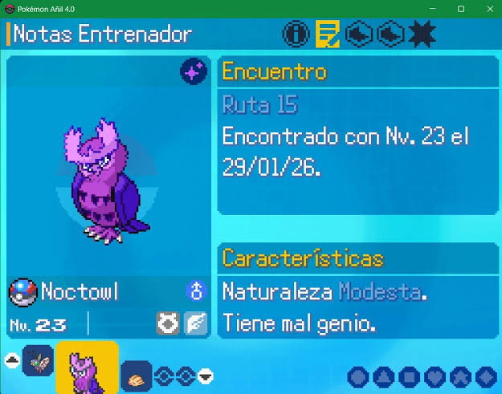 | 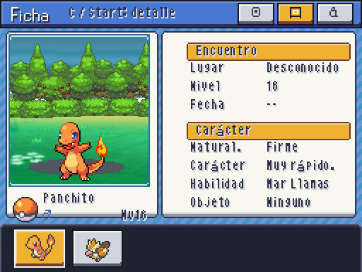 |
| 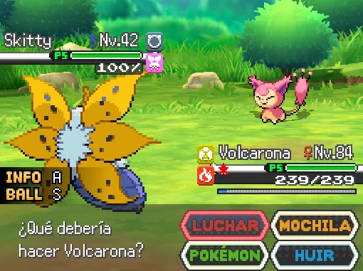 | 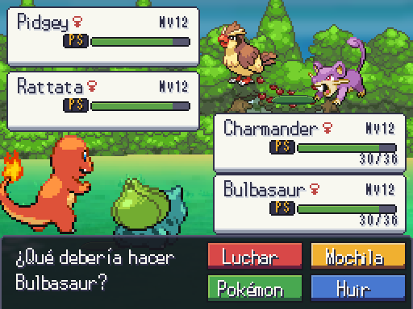 |

PENDIENTE JAVIER: aprobación visual. Mapa/medallas, identidad y música conservan sus preguntas abiertas. Guardería y sistemas nuevos conservan sus dependencias de integración.

## Galería de todas las pantallas y estados revisados

| Captura | Estado |
| --- | --- |
| [dialogue](repaso_2026-10-07/a3_dialogue.png) | Captura real |
| [choice](repaso_2026-10-07/a3_choice.png) | Captura real |
| [volume](repaso_2026-10-07/a3_volume.png) | Captura real |
| [recordador](repaso_2026-10-07/a3_recordador.png) | Captura real |
| [tutor](repaso_2026-10-07/a3_tutor.png) | Captura real |
| [controls](repaso_2026-10-07/a3_controls.png) | Captura real |
| [controls_names](repaso_2026-10-07/a3_controls_names.png) | Captura real |
| [summary_data](repaso_2026-10-07/a3_summary_data.png) | Captura real |
| [summary_notes](repaso_2026-10-07/a3_summary_notes.png) | Captura real |
| [summary_stats](repaso_2026-10-07/a3_summary_stats.png) | Captura real |
| [summary_long](repaso_2026-10-07/a3_summary_long.png) | Captura real |
| [summary_moves](repaso_2026-10-07/a3_summary_moves.png) | Captura real |
| [options](repaso_2026-10-07/a3_options.png) | Captura real |
| [options_volumes](repaso_2026-10-07/a3_options_volumes.png) | Captura real |
| [options_return](repaso_2026-10-07/a3_options_return.png) | Captura real |
| [options_yellow](repaso_2026-10-07/a3_options_yellow.png) | Captura real |
| [options_green](repaso_2026-10-07/a3_options_green.png) | Captura real |
| [run_notice](repaso_2026-10-07/a3_run_notice.png) | Captura real |
| [title_0](repaso_2026-10-07/a3_title_0.png) | Captura real |
| [title_1](repaso_2026-10-07/a3_title_1.png) | Captura real |
| [title_2](repaso_2026-10-07/a3_title_2.png) | Captura real |
| [title_reduced](repaso_2026-10-07/a3_title_reduced.png) | Captura real |
| [splash](repaso_2026-10-07/a3_splash.png) | Captura real |
| [notice](repaso_2026-10-07/a3_notice.png) | Captura real |
| [intro](repaso_2026-10-07/a3_intro.png) | Captura real |
| [main_menu](repaso_2026-10-07/a3_main_menu.png) | Captura real |
| [credits](repaso_2026-10-07/a3_credits.png) | Captura real |
| [name](repaso_2026-10-07/a3_name.png) | Captura real |
| [slots](repaso_2026-10-07/a3_slots.png) | Captura real |
| [pause](repaso_2026-10-07/a3_pause.png) | Captura real |
| [party](repaso_2026-10-07/a3_party.png) | Captura real |
| [bag](repaso_2026-10-07/a3_bag.png) | Captura real |
| [bag_items](repaso_2026-10-07/a3_bag_items.png) | Captura real |
| [shop](repaso_2026-10-07/a3_shop.png) | Captura real |
| [quantity](repaso_2026-10-07/a3_quantity.png) | Captura real |
| [dex](repaso_2026-10-07/a3_dex.png) | Captura real |
| [dex_entry](repaso_2026-10-07/a3_dex_entry.png) | Captura real |
| [dex_area](repaso_2026-10-07/a3_dex_area.png) | Captura real |
| [dex_shiny](repaso_2026-10-07/a3_dex_shiny.png) | Captura real |
| [dex_forms](repaso_2026-10-07/a3_dex_forms.png) | Captura real |
| [pc](repaso_2026-10-07/a3_pc.png) | Captura real |
| [trainer_card](repaso_2026-10-07/a3_trainer_card.png) | Captura real |
| [region_map](repaso_2026-10-07/a3_region_map.png) | Captura real |
| [learn_move](repaso_2026-10-07/a3_learn_move.png) | Captura real |
| [evolution](repaso_2026-10-07/a3_evolution.png) | Captura real |
| [professor_intro](repaso_2026-10-07/a3_professor_intro.png) | Captura real |
| [shift](repaso_2026-10-07/a3_shift.png) | Captura real |
| [forced](repaso_2026-10-07/a3_forced.png) | Captura real |
| [transition_before](repaso_2026-10-07/a3_transition_before.png) | Captura real |
| [transition_wild](repaso_2026-10-07/a3_transition_wild.png) | Captura real |
| [transition_trainer](repaso_2026-10-07/a3_transition_trainer.png) | Captura real |
| [transition_leader](repaso_2026-10-07/a3_transition_leader.png) | Captura real |
| [motion_physical](repaso_2026-10-07/a3_motion_physical.png) | Captura real |
| [motion_special](repaso_2026-10-07/a3_motion_special.png) | Captura real |
| [motion_status](repaso_2026-10-07/a3_motion_status.png) | Captura real |
| [motion_scratch](repaso_2026-10-07/a3_motion_scratch.png) | Captura real |
| [motion_stringshot](repaso_2026-10-07/a3_motion_stringshot.png) | Captura real |
| [motion_vinewhip](repaso_2026-10-07/a3_motion_vinewhip.png) | Captura real |
| [battle_double](repaso_2026-10-07/a3_battle_double.png) | Captura real |
| [double_target](repaso_2026-10-07/a3_double_target.png) | Captura real |
| [battle_long](repaso_2026-10-07/a3_battle_long.png) | Captura real |
| [mechanics_menu](repaso_2026-10-07/a3_mechanics_menu.png) | Captura real |
| [mega](repaso_2026-10-07/a3_mega.png) | Captura real |
| [zmove](repaso_2026-10-07/a3_zmove.png) | Captura real |
| [dynamax](repaso_2026-10-07/a3_dynamax.png) | Captura real |
| [tera](repaso_2026-10-07/a3_tera.png) | Captura real |
| [daycare](repaso_2026-10-07/a3_daycare.png) | Captura real |
| [hatching_egg](repaso_2026-10-07/a3_hatching_egg.png) | Captura real |
| [hatching_born](repaso_2026-10-07/a3_hatching_born.png) | Captura real |
| [locke_mode](repaso_2026-10-07/a3_locke_mode.png) | Captura real |
| [locke_settings](repaso_2026-10-07/a3_locke_settings.png) | Captura real |
| [locke_generating](repaso_2026-10-07/a3_locke_generating.png) | Captura real |
| [locke_summary](repaso_2026-10-07/a3_locke_summary.png) | Captura real |
| [locke_cemetery](repaso_2026-10-07/a3_locke_cemetery.png) | Captura real |
| [locke_game_over](repaso_2026-10-07/a3_locke_game_over.png) | Captura real |
| [locke_zone](repaso_2026-10-07/a3_locke_zone.png) | Captura real |
