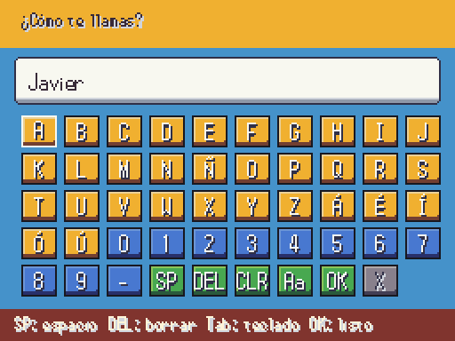

# Teclado de nombres · A3 · 2026-10-06

| Antes: entrada provisional | Después: teclado visible |
|---|---|
|  |  |

Teclado de mando/teclas con mayúsculas/minúsculas, Ñ, vocales acentuadas, números, guion, espacio, borrar y limpiar. Tab activa la entrada física (admite pegar); Intro confirma. Las letras Z/X se escriben al usar el teclado físico, sin activar acciones de la rejilla. El primer carácter reemplaza el nombre provisional. No se acepta vacío; identidades y motes obligatorios no se cancelan. Límite 12 caracteres para nombres, configurable para códigos.

Conectado a `Cutscene.name_requested`, `SceneManager.request_text` y motes de Locke. La reanudación al cargar vuelve a emitir la señal existente y no regenera la ROM. `Dialogue.format_text` incorpora WorldNames antes de DataDB: nombre de diseño y rival elegido siguen separados.

Captura reproducible con `tools/arte/capture_ui.gd -- --screen=name`. Los tests de mundo usan ahora esta pantalla, incluida la reanudación de motes guardados.

Validación: 308/308 tests tras integrar dobles de A2, 3772 aserciones, 83,9 s; 10521 PNG con 0 errores/0 avisos. Incluye input real de Z como letra, rechazo del vacío, límite y liberación de bloqueos; teclado anterior retirado al salir y uno nuevo al cargar un mote pendiente.
