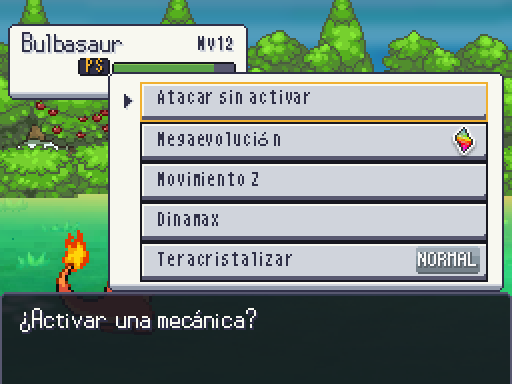
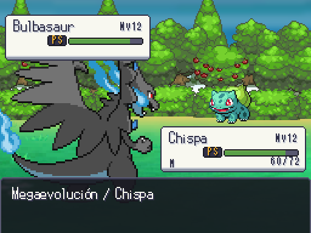
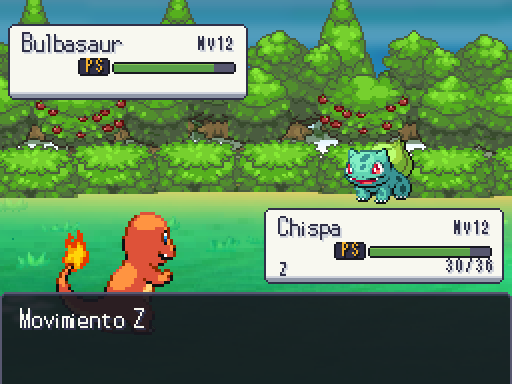
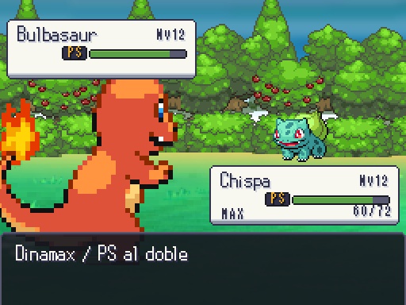
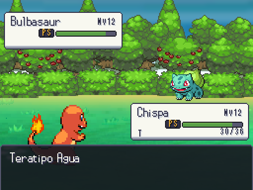

# Mega, Z, Dinamax y Tera (2026-10-07)

Controles ofrecidos por can_mega/z_moves/can_dynamax/can_tera de la petición; Z depende además del movimiento elegido. Normal y cancelar no gastan una mecánica. Un indicador textual evita depender del color: M (Mega), Z, MAX (Dinamax) y T (Tera). El menú Mega usa símbolo original EBDX y Tera el icono original del tipo. Mando A selecciona y B vuelve.

| Antes | Ahora |
| --- | --- |
| Solo luchar |  |
| Sin presentación Mega |  |
| Sin presentación Z |  |
| Sin tamaño/PS Dinamax |  |
| Sin indicador Tera |  |

Mega cambia a la especie del evento sin modificar el equipo; nube de energía ebMega006 original EBDX. Dinamax usa duplicación entera ×2 y recorte del viewport (sin deformación); PS y final vienen del evento. Tera conserva el indicador por miembro al retirarse/volver. Z/Tera/Dinamax usan los efectos originales publicados: no hay secuencia dedicada de Z/Tera en estos packs. Reducir animaciones conserva la transformación y omite efectos.

PENDIENTE JAVIER: aprobación de esta presentación y, si se quieren símbolos propios Z/Max/Tera en vez de los identificadores actuales, sus diseños de A4. No se declara Gigamax/Estelar ni los efectos Z de estado que el motor deja pendientes.
