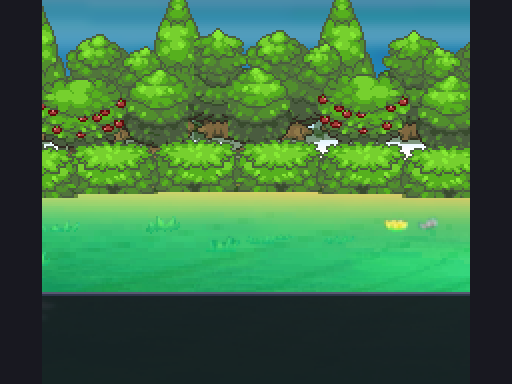
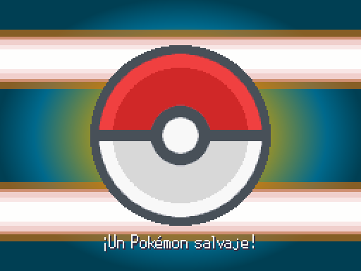
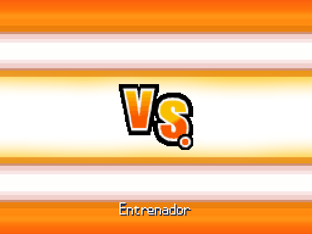
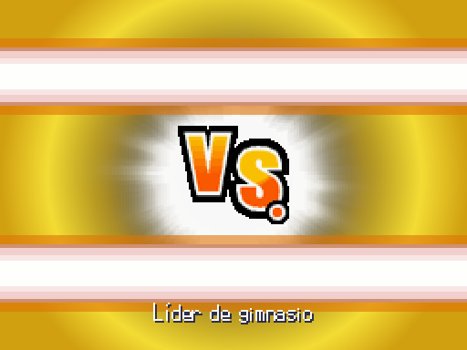

# Entradas EBDX — A3, 2026-10-06

Se sustituye la cortinilla de dos bloques por composiciones con gráficos originales de EBDX. Capturas reales a 512×384, en el mismo punto de entrada; no se reescalan ni giran los sprites y las posiciones se redondean.

| Antes | Salvaje |
|---|---|
|  |  |

| Entrenador | Líder |
|---|---|
|  |  |

Salvaje: fondo Forest y Poké Ball Common entran con dos bandas de velocidad. Entrenador: fondo Default centrado y encuadrado (640×480 original) y VS Common; retrato del entrenador si su recurso existe. Líder: fondo Gold, brillo Elite y VS. Los ejemplos no inventan nombres ni retratos: el real usa `display_name` y `battle_sprite` del contrato.

`BattleEntryTransition.select_kind(info)` usa `info.transition` explícito cuando existe, y si no el tipo de combate y `leader_type` de los datos del entrenador. No intenta adivinar líderes por su nombre. Duración 1,2 s (líder 1,5 s), entradas con frenado, opacidad al salir y limpieza del nodo antes del menú de combate. `fast` no crea la transición. Manifiesto de hashes y medidas, importador reproducible y validador de arte con tamaños originales exactos.

La entrada queda integrada en BattleScene; A4 conserva fondos del campo, bases y arte de entrenadores. Siguiente entrega: animaciones de movimientos.
