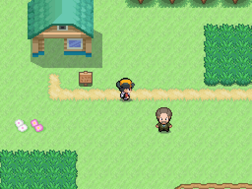
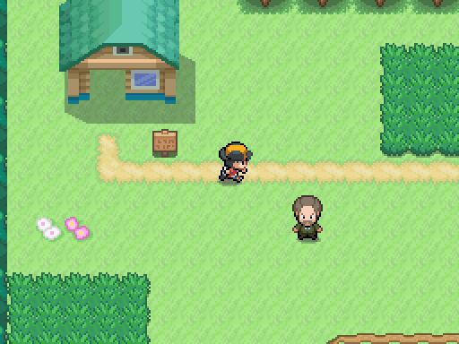

# Alternar correr

Mismo protagonista, dirección y mapa en Godot. Izquierda caminando con always_run=false; derecha después del evento run_toggle sin mantener Shift, usando la hoja de correr existente del pack 05. Cada casilla tarda 0,25 s andando y 0,125 s corriendo. Shift/B invierte el ajuste. El ajuste persiste con la partida; interiores pequeños, can_run=false, bicicleta y Surf no usan carrera.

| Correr desactivado | Correr activado con R/Y |
|---|---|
|  |  |

Captura real: `godot --path . --rendering-method gl_compatibility --audio-driver Dummy -s maps/_tools/capture_run_toggle.gd`. Aviso breve y menú de opciones corresponden a A3 (39), pendientes. Esta comparativa verifica movimiento/hoja existente, no presenta ese aviso como terminado.
