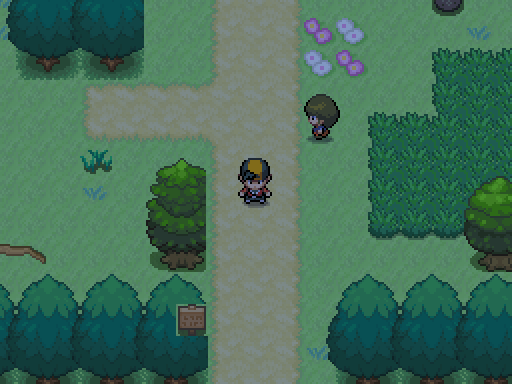

# Día y noche del mundo

Capturas reales de la ruta pintada por A4 (`muestras/ruta`), cámara y assets idénticos. Izquierda al mediodía; derecha a las 22:00 con el tinte configurado en world.clock.tints. Se modula el canvas del mundo; UI y combate conservan su canvas separado. Interiores sin tinte. Cambio de periodo con transición de 2 segundos, reloj real.

| Día | Noche |
|---|---|
|  |  |

Paleta de tinte provisional para revisión de Javier. NightLight y partículas/ambiente están preparados pero esperan los sprites/máscaras/sonidos y posiciones de A4/A3 (42/41); no se representan como completos en estas capturas.

Reproducir: `godot --path . --rendering-method gl_compatibility --audio-driver Dummy -s maps/_tools/capture_day_night.gd`.
