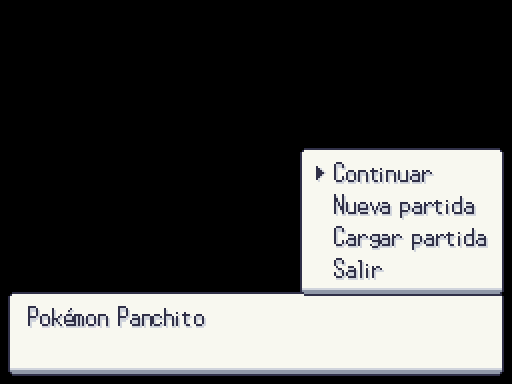
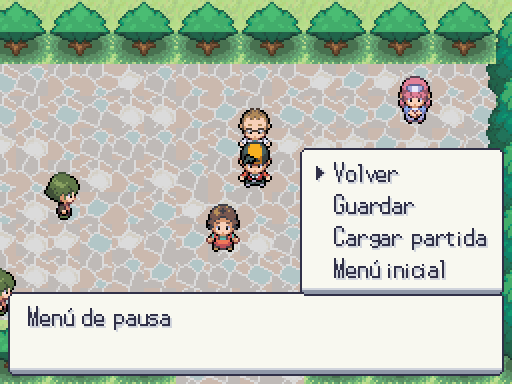
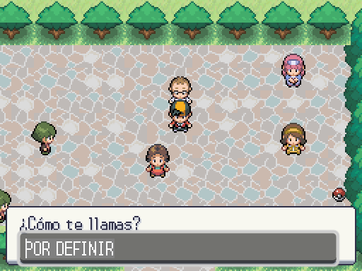
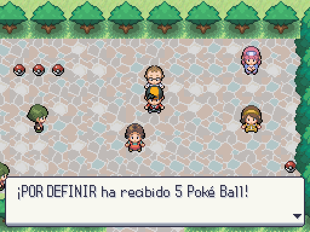

# Flujo provisional de partida

Se reutilizan Dialogue, UiCanvas y Theme del proyecto. Son sustitutos de integración que A3 reemplazará por sus pantallas. No se declara aprobado su diseño.

| Menú inicial | Menú de pausa |
|---|---|
|  |  |

| Entrada de nombre | Recompensa ya existente |
|---|---|
|  |  |

El arranque sin argumentos abre el menú inicial; nueva partida elige ranura (confirma si está ocupada), ejecuta la intro y permite introducir jugador/rival con teclado. Pausa permite guardar en su ranura, cargar y volver al título. Continuar usa la última ranura y rechaza RandomLocke terminado. `options.intro=true` activa la intro en SceneManager, conservando el arranque directo de pruebas.

Capturas reales: `godot --path . --rendering-method gl_compatibility --audio-driver Dummy -s maps/_tools/capture_game_flow.gd`. Pruebas con input real en `tests/mundo/test_game_flow.gd`.
