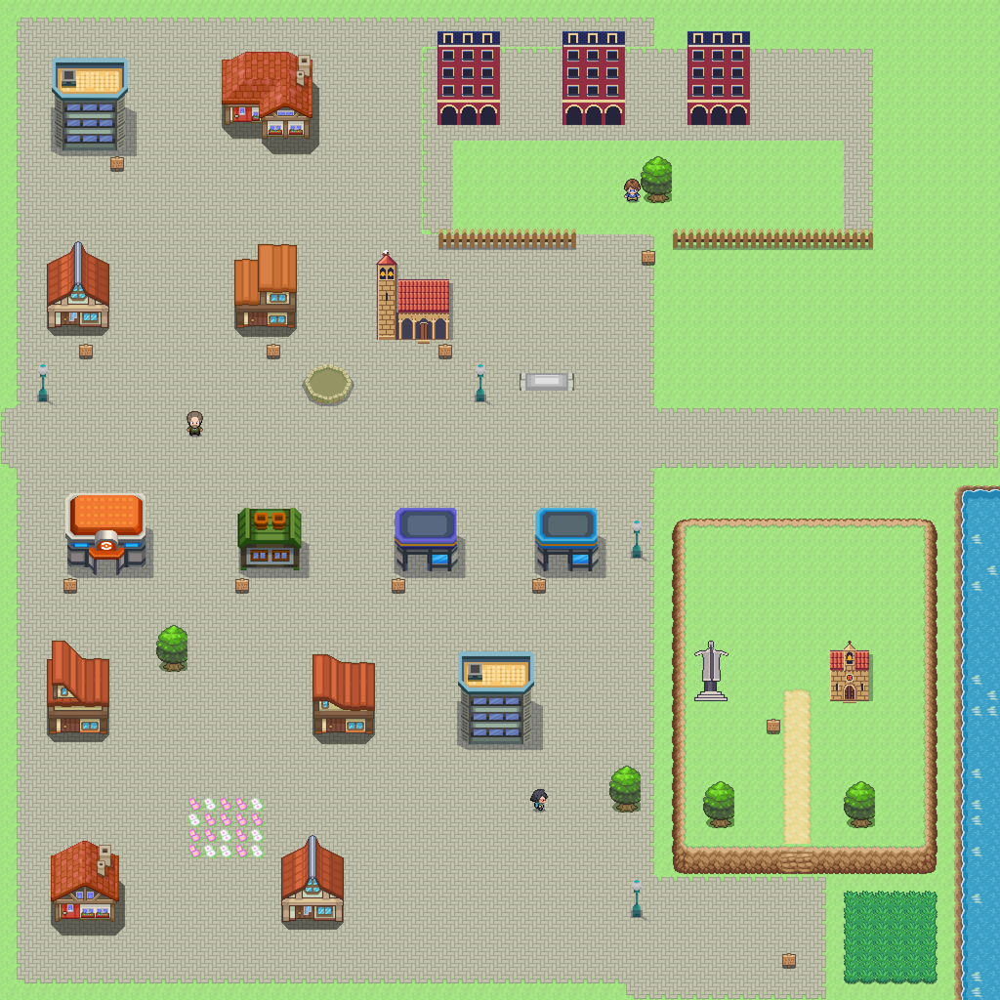

# Getafe · Comparativa provisional

Referencia de escala y suelo: [Valladolid](valladolid_mapa.png) y [Añil](../referencias/anil_pueblo.png). Centro pavimentado, Coliseum al norte y Cerro al este. El exterior usa las distancias comprimidas del [plano real](../../mundo/planos/getafe.svg).

| Cerro, fuente 358 | Catedral Magdalena, fuente 359 | Iglesia propia de origen |
|---|---|---|
|  |  |  |

Figura y pedestal dibujados a mano, exportación ×2. La catedral adapta el dibujo propio: **no representa todavía todos los volúmenes renacentistas**. Graderío del Coliseum compuesto con soportales y cancha de tiles de hierba. Hospitalillo y Ayuntamiento, aproximaciones de edificios DPPt. Revisión arquitectónica y visual pendiente Javier, con [referencia de Magdalena](https://www.madrid.org/monumentoscercanias/catedral-santa-m-magdalena.html) y [monumento del Cerro](https://cerrodelosangeles.es/monumento/). Sin aprobación final ni interiores.
