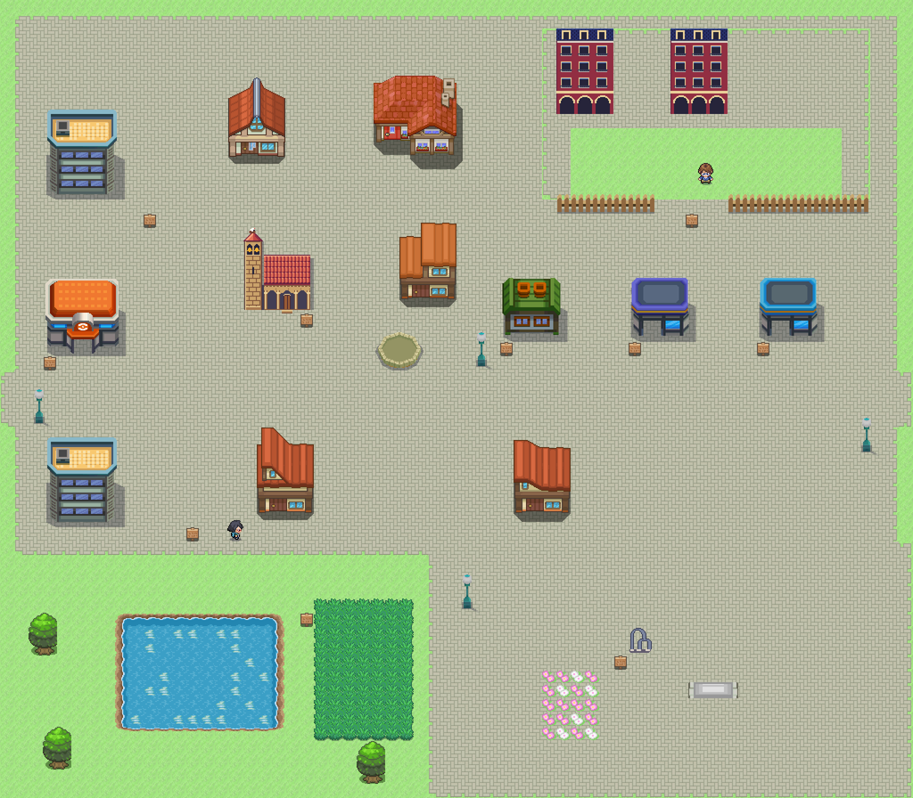
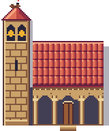
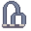

# Leganés · Comparativa provisional

Referencias de escala: [Getafe](getafe_mapa.png) y [Añil](../referencias/anil_pueblo.png). Los edificios miran al sur; Polvoranca queda al suroeste y el museo al sureste del centro. [Plano OSM](../../mundo/planos/leganes.svg).

| San Salvador, adaptación fuente 360 | Iglesia propia de origen | Escultura abstracta fuente 361 |
|---|---|---|
|  |  |  |

La fachada barroca aún necesita trabajo de fidelidad. Los arcos de metal son una interpretación propia para señalizar el museo, **no una reproducción de una obra real** ni una atribución a sus escultores. Pendiente Javier elegir/revisar la representación a partir de la [colección municipal](https://www.leganes.org/w/museo-de-escultura-leganes). Butarque y cuartel se componen con los recursos existentes. Arte provisional, sin interiores.
