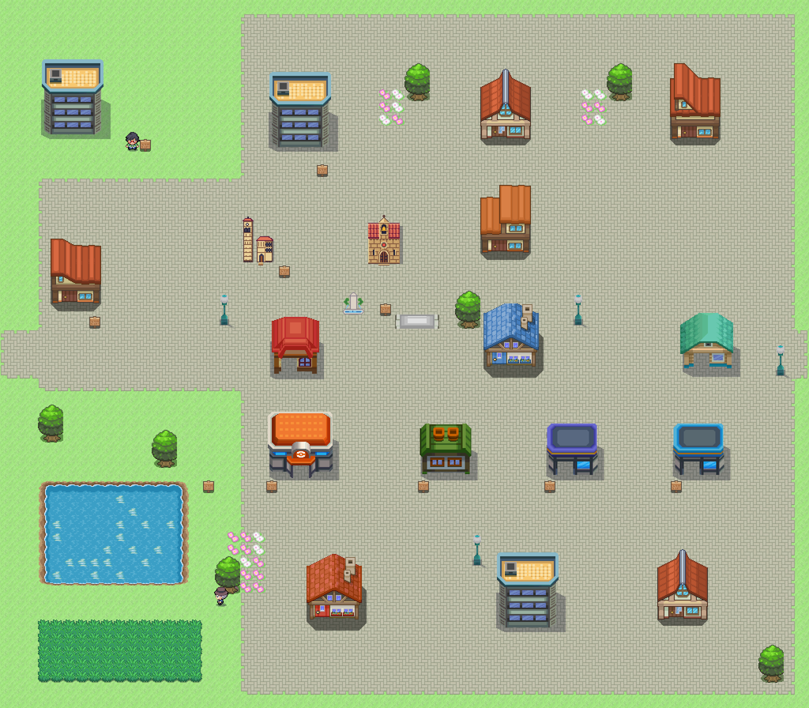

# Móstoles · Comparativa provisional

Referencias de escala: [Leganés](leganes_mapa.png) y [Añil](../referencias/anil_pueblo.png). Campus al noroeste, El Soto al oeste y casco con Pradillo al centro. [Plano OSM](../../mundo/planos/mostoles.svg).

| Fuente de los Peces · 362 | Asunción · 365 |
|---|---|
|  |  |

Referencias municipales: [dos tritones y pedestal de la fuente](https://www.mostoles.es/es/localizaciones/monumentos/fuente-peces), [ábside y torre de la Asunción](https://www.mostoles.es/es/localizaciones/monumentos/iglesia-senora-asuncion). Ambos son dibujos propios compactos. La iglesia simplifica la curvatura del ábside y la distribución de su planta; la ermita utiliza el recurso propio existente. Fidelidad, escala y detalle pendientes Javier. Sin interiores ni famosos. Las clases de entrenadores ya existentes se conservan.
