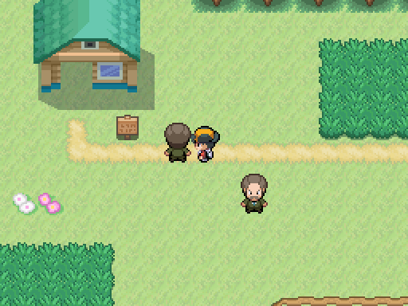
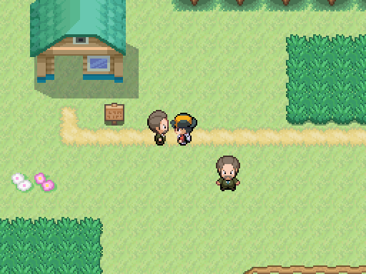

# Hablar desde un lado

Capturas de Godot, 512×384, mismo mapa, posiciones y assets del pack 05. Antes del diálogo el NPC mira arriba; el jugador a su derecha mira a la izquierda. Al pulsar aceptar, el NPC se gira a la derecha antes de hablar. La base ya admitía esta aproximación: la sesión añade cobertura y el ajuste `turn_on_interact=false` para excepciones de guion, sin cambiar el arte.

| Antes de hablar | Después de aceptar |
|---|---|
|  |  |

Reproducir: `godot --path . --rendering-method gl_compatibility --audio-driver Dummy -s maps/_tools/capture_npc_interaction.gd`.

Las 16 combinaciones de cara/acercamiento, cuatro mostradores, paseo detenido y entrenador se verifican en `tests/mundo/test_npc_interaction.gd`.
