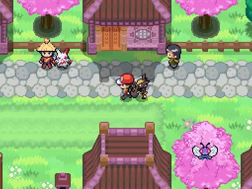
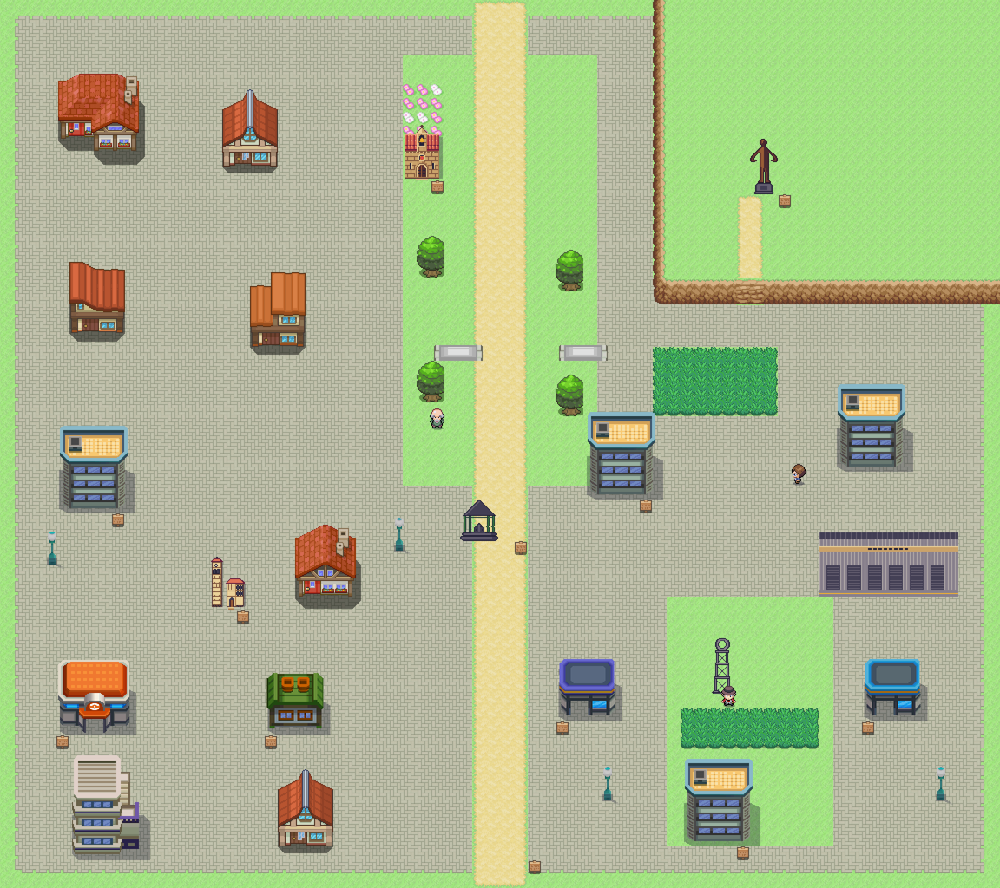
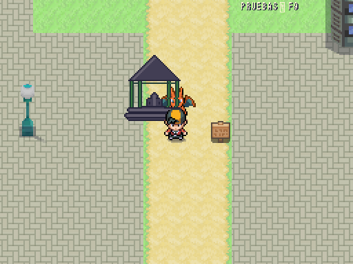

# Puertollano · Comparativa provisional

| Referencia de ciudad · Añil | Puertollano · vista general a ×0,5 |
|---|---|
|  |  |

72×64 casillas, norte arriba. [Plano OSM](../../mundo/planos/puertollano.svg), 20 m por casilla real, con distancias comprimidas en el juego. Paseo de San Gregorio central norte-sur, Cerro de Santa Ana y su mirador al noreste, parque del Pozo Norte al sureste, estación al oeste. Cuatro locales preparados. Se conservan sus carteles de interior pendiente; no hay puertas con destinos ficticios.

| Fuente Agria · 367 | Castillete · 368 | Monumento al Minero · 369 |
|---|---|---|
|  |  |  |

Dibujos manuales por filas, exportados a ×2, sin generar formas por código. Fuente: pabellón de hierro verde, cubierta piramidal gris y pila interior; la vista compacta simplifica su planta octagonal. Castillete: celosía metálica y rueda superior. Monumento: figura de bronce facetada con manos abiertas y pedestal, interpretación compacta de la obra de Pepe Noja. Fidelidad, escala y detalle **pendientes Javier**, sin marcar ninguna pieza final. Asunción usa el dibujo propio de Móstoles como adaptación provisional; ermita, baños, viviendas y nave industrial son composiciones con piezas existentes.

Referencias primarias: [Fuente Agria, Turismo de Castilla-La Mancha](https://www.turismocastillalamancha.es/es/cultura-y-patrimonio/monumentos/ciudad-real/fuente-agria-de-puertollano), [Museo de la Minería](https://www.turismocastillalamancha.es/es/cultura-y-patrimonio/museos/ciudad-real/museo-de-la-mineria-de-puertollano) y [Monumento al Minero, Ayuntamiento](https://mapas.puertollano.es/es/global/resource/r/monumento-al-minero_602). El Ayuntamiento indica **9 metros y Pepe Noja**; corregida la ficha que decía 17 m.

Encuentros 49–52 en el paseo/zona industrial, dos entrenadores genéricos con clases existentes jubiladoobras/cunado. Equipos por DataDB y parcheables por RandomLocke. La fuente aún no cura ni regala objetos; mina, AVE y famosos esperan recursos/reglas/guion. El gimnasio 8 está reservado a Málaga.

Ruta 24 sur columnas 24–27 ⇄ Puertollano norte 34–37, offsets +10/−10, cuatro salidas libres. `from_ruta_25` en (35,63) preparado para el siguiente mapa. Alcance desde ambas entradas: 17 puertas, carteles y entrenadores accesibles, 0 problemas. Carga medida 115,53 ms antes del último ajuste de decorado. El menú F9 descubre automáticamente el mapa.

2026-10-10: abierto el enlace sur a Ruta 25, offsets −10/+10; las 17 puertas y ambos bordes pasan alcance sin problemas.

## Escala del juego: 512×384

| Añil | Juego real, sesión temporal F9 |
|---|---|
|  |  |

Captura nativa con personaje y seguidor, sin reescalar el mundo ni los sprites.
