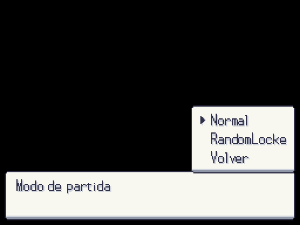
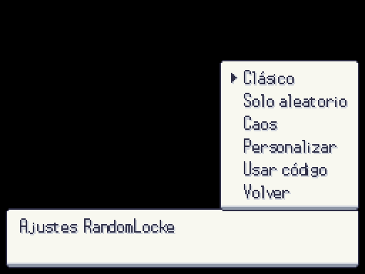
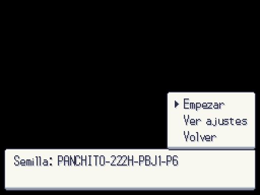
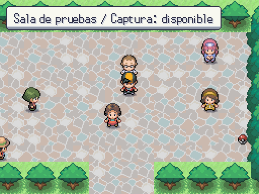
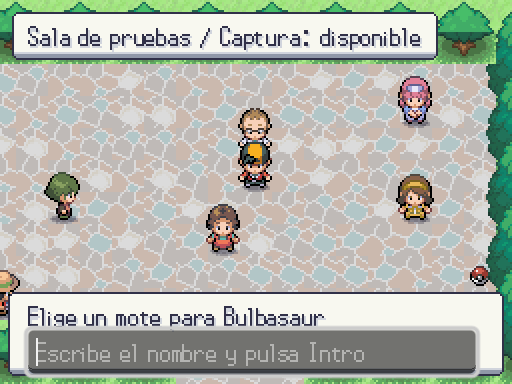

# Flujo RandomLocke provisional — 2026-10-05

Antes: la nueva partida del título solo iniciaba modo normal. El motor RandomLocke existía, pero faltaba su orquestación visible y el teclado de motes.

Ahora: ranura → modo → preset, todos los ajustes por páginas o código completo → generación en hilo → resumen de reglas/semilla → intro. Se reutilizan Dialogue, Theme y UiCanvas de A3; son sustitutos hasta recibir sus pantallas. La ROM se genera con entrada copiada, sin tocar DataDB desde el hilo. El mapa muestra el estado de captura de su zone_id, compartido entre plantas. El mote se escribe con teclado y se recuperan los pendientes de una partida guardada.

Capturas reales del juego con el perfil de mapas `test`; no es el cierre del MVP real. Una ROM ausente, incompatible con los datos o con referencias inválidas se rechaza antes de reemplazar la partida. No se regenera silenciosamente una ROM guardada. Las ROM v1 válidas conservan compatibilidad.

| Modo | Ajustes |
|---|---|
|  |  |

| Resumen y código | Zona |
|---|---|
|  |  |

Reproducir: `godot --path . --rendering-method gl_compatibility --audio-driver Dummy -s maps/_tools/capture_randomlocke.gd`. Usa una carpeta XDG_DATA_HOME aparte de los tests. La captura incluye una entrega de inicial fixture para enseñar el teclado; no añade una especie al guion.
