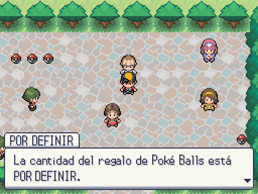

# Recompensa del profesor

Mismo evento en la sala real de Godot; izquierda configuración anterior (cantidad pendiente), derecha decisión de Javier (cinco Poké Balls). Las capturas ejecutan `MvpStoryEvent.rewards()` y `Cutscene.give_item`, sin sustituir el diálogo. Nombre de diseño POR DEFINIR, ahora centralizado en world.names.

| Cantidad anterior | Decisión de Javier |
|---|---|
|  |  |

Generar: `godot --path . --rendering-method gl_compatibility --audio-driver Dummy -s maps/_tools/capture_mvp_reward.gd`.
