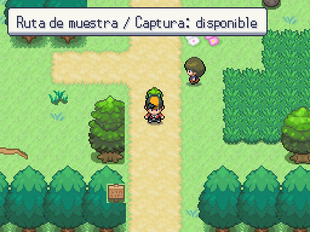

# Robustez de carga — 2026-10-05

Antes: SceneManager descargaba el mapa actual antes de comprobar la raíz de la escena; un spawn desconocido podía acabar en el spawn por defecto y una carga guardada con coordenadas inválidas reemplazaba el estado antes de detectar el problema.

Ahora: se valida escena, MapRoot, metadatos, Ground y destino exacto antes de alterar mapa o partida. Un error devuelve Error y emite map_load_failed; conserva el origen y el control. La cache guarda PackedScene, nunca instancias vivas; cada mapa crea sus propias entidades. Si --map especifica un mapa sin --spawn se usa default; la nueva partida del título conserva el spawn intro configurado.

Capturas reales: se intenta no/existe desde la ruta de A4. El origen permanece visible y jugable, sin colocar al jugador en (0,0). Se conserva el Theme y el arte existente.

| Destino válido | Destino inválido: origen preservado |
|---|---|
|  |  |

Mediciones y comandos reproducibles en [robustez.md](../../mapas/robustez.md). El recorrido normal/RandomLocke ampliado sigue sobre el prototipo test, sin Debug; no sustituye la revisión del pueblo ni los mapas reales del MVP.
