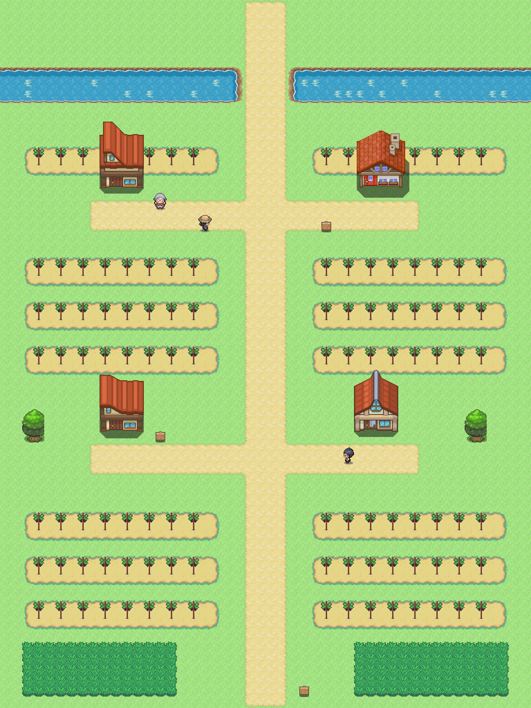

# Ruta 21 · Comparativa provisional

La [referencia de ruta de Añil](../referencias/anil_ruta.png) y la [Ruta 6](ruta_6_mapa.png) fijan la escala y el uso de casas DPPt. La Rioja cambia el bosque por campos trabajados en hileras, con calles entre espalderas. Norte arriba; vista completa a mitad de escala, como las otras rutas.

## Pieza nueva junto a una pieza existente

| Cepa propia (fuente 350, ×2) | Árbol del set existente |
|---|---|
|  | Véase el árbol en el centro de la captura, junto a los calados |

Cepa dibujada a mano en `.px2`, paleta maestra; provisionales tanto pieza como composición. Bodegas sin interior, sin famosos. No se declara aprobado el nivel gráfico.
