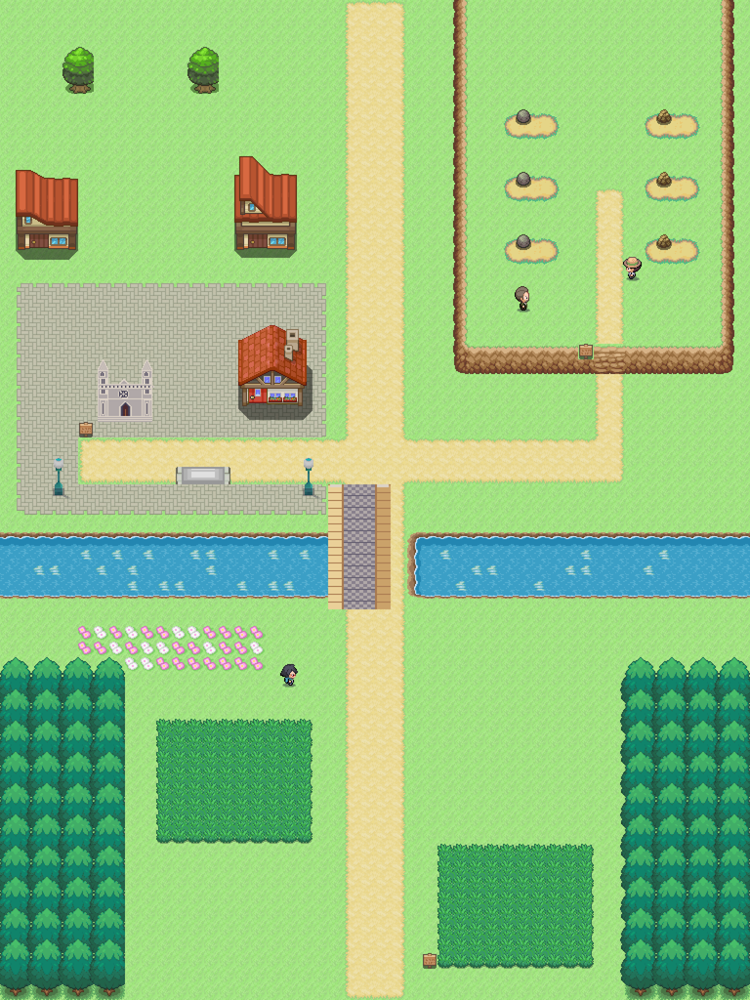
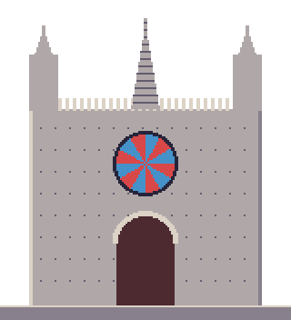

# Ruta 22 · Comparativa provisional

Referencia de escala y densidad: [Ruta 6](ruta_6_mapa.png) y [Añil](../referencias/anil_ruta.png). Burgos se compacta al oeste; Atapuerca ocupa la meseta este. El Arlanzón deja un cruce seco sobre el tablero del puente.

## Catedral propia y recurso existente

| Catedral de Burgos, paleta maestra y ×2 | Catedral de Barcelona existente |
|---|---|
|  |  |

Dos agujas, galería, rosetón y tres portadas; interpretación compacta provisional. [Fuente oficial](https://catedraldeburgos.es/patrimonio/portadas/). No hay aprobación visual ni interiores.
