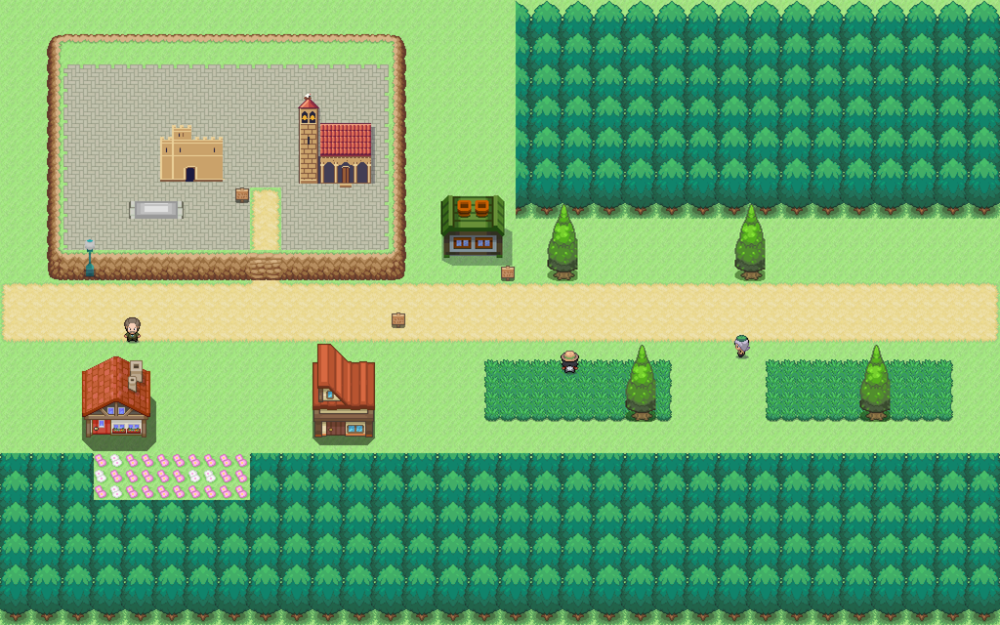
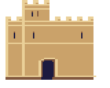
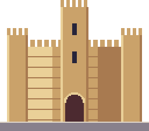
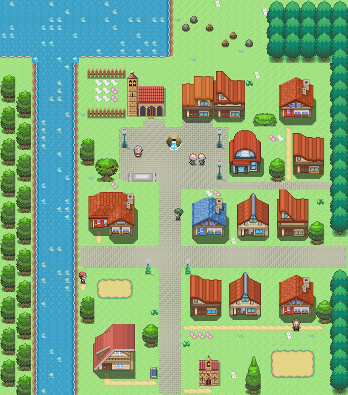
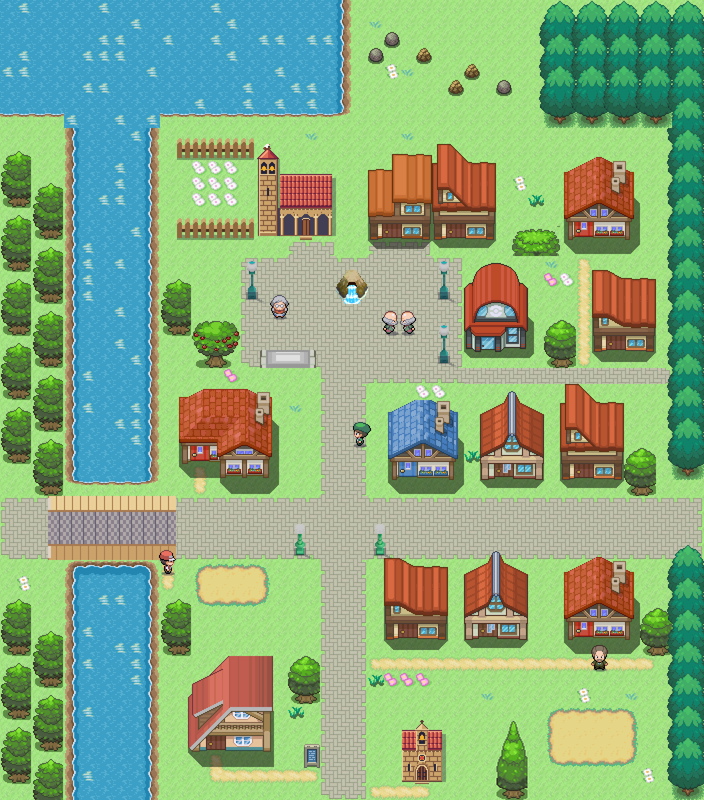

# Ruta 23 · Comparativa provisional

Referencia de escala: [Ruta 22](ruta_22_mapa.png) y [Añil](../referencias/anil_ruta.png). Castillo y casco en la meseta; Tierra de Pinares al este y sur.

| Castillo de Cuéllar, fuente 357 | Castillo de Bellver del set propio |
|---|---|
|  |  |

Dibujo manual, exportación ×2 y paleta maestra. La fachada compacta necesita revisión de textura y escala antes de aprobación. [Referencia municipal](https://www.cuellar.es/castillo-de-los-duques-de-alburquerque/).

## Regreso al pueblo

| San Miguel anterior | Solo acceso occidental y puente nuevos |
|---|---|
|  |  |

Puente de piedra existente transpuesto en Decor: suelo pisable bajo el tablero, sin tocar los eventos del MVP. Alcance comprobado desde ambos lados. Toda la composición sigue provisional.
