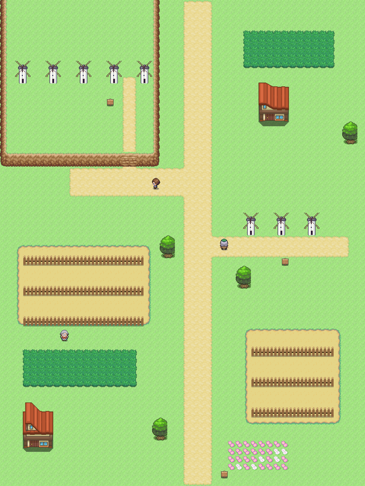
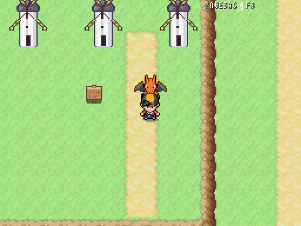

# Ruta 24 · La Mancha · Comparativa provisional

| Escala de ruta · Añil | Ruta 24 · vista general a ×0,5 |
|---|---|
|  |  |

Norte arriba, 48×64 casillas. Consuegra al oeste, sobre el Cerro Calderico, y Campo de Criptana al este. El mapa reúne ambos conjuntos, separados por unos 50 km en la realidad: posición relativa y distancias comprimidas, sin presentarlos como un único pueblo. [Plano real de Consuegra](../../mundo/planos/ruta_24.svg), OSM con cuadrícula de 80 m por casilla, no plano exacto del juego.

Molino dibujado a mano por filas en `molino_mancha.px2`, a 32×48 y exportado a ×2: cilindro blanco, cubierta cónica oscura y cuatro aspas de madera. Referencias: [Ayuntamiento de Consuegra](https://www.consuegra.es/es/descubre/monumentos/molinos-de-consuegra?p=conoce-consuegra%2Fmonumentos%2Fmolinos-de-viento), [Cerro Calderico](https://www.turismocastillalamancha.es/es/cultura-y-patrimonio/molinos/toledo/molinos-de-viento-del-cerro-calderico) y [Campo de Criptana](https://www.turismocastillalamancha.es/es/cultura-y-patrimonio/molinos/ciudad-real/molinos-de-viento-de-campo-de-criptana). Representación compacta; número, textura y escala pendientes de revisión de Javier. Cinco molinos representan Consuegra, tres Campo de Criptana, sin afirmar el número real.

Parcelas de secano con suelo y vallas existentes; aún sin sprite específico de cereal. Hierba de encuentros fuera del camino principal: Hoppip, Swablu, Tauros y Doduo, niveles 48–51 según `data/region.json`. Caballero y escudero genéricos, con clases existentes cuñado/pastor; guiño previsto en `rutas.md`, sin personaje famoso ni guion nuevo. Equipos por ID de DataDB, compatibles con RandomLocke. Interiores pendientes de tileset.

Getafe sur columnas 46–49 ⇄ Ruta 24 norte 24–27, offsets −22/+22; cuatro casillas libres por borde. Llegada sur `from_puertollano` preparada, sin conectar con un mapa inexistente. Prueba de alcance desde norte y sur: diez puertas, carteles, entrenadores y salida norte accesibles. Getafe: quince puertas y sus dos conexiones accesibles. El menú F9 incorpora automáticamente este mapa.

2026-10-10: abierta la unión sur con Puertollano, offsets +10/−10, cuatro casillas libres por lado; cartel actualizado.

## Escala del juego: 512×384

| Añil | Juego real, sesión temporal F9 |
|---|---|
|  |  |

Captura nativa con personaje y seguidor, sin reescalar el mundo ni los sprites.
