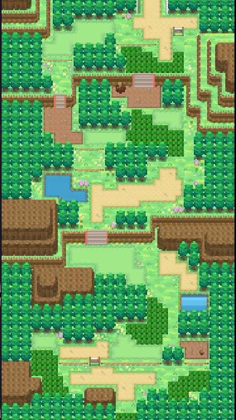
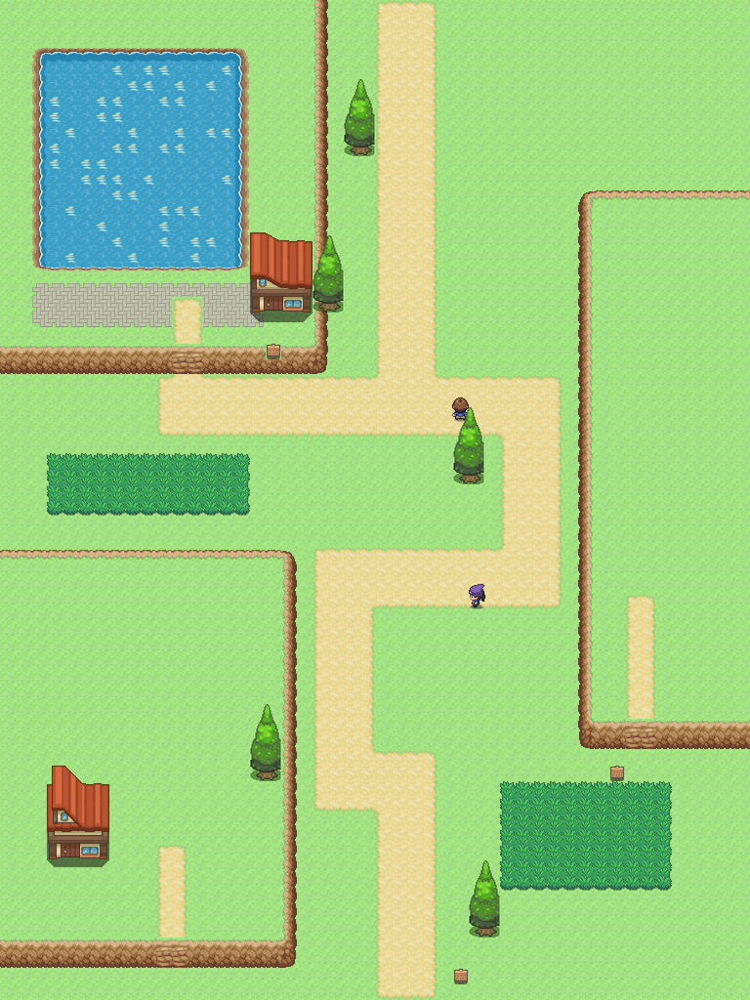
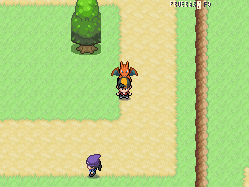

# Ruta 25 · Despeñaperros · Comparativa provisional

| Referencia de ruta · Añil | Ruta 25 · vista general a ×0,5 |
|---|---|
|  |  |

48×64, norte arriba. Camino de cuatro casillas con curvas entre riscos del pack existente; presa/embalse del Montoro en la meseta noroeste. El embalse está lejos del desfiladero en la realidad: se comprimen los kilómetros manteniendo su posición relativa. [Plano OSM de Despeñaperros](../../mundo/planos/ruta_25.svg), cuadrícula real de 150 m por casilla, no distribución exacta del juego.

Referencias primarias: [Parque Natural Despeñaperros, Junta de Andalucía](https://www.juntadeandalucia.es/medioambiente/portal/web/ventanadelvisitante/detalle-buscador-mapa/-/asset_publisher/Jlbxh2qB3NwR/content/despe%C3%B1aperros-1), [Los Órganos](https://www.juntadeandalucia.es/medioambiente/portal/areas-tematicas/espacios-protegidos/legislacion-autonomica-nacional/monumentos-naturales/monumento-natural-organos), [Montoro y abastecimiento de Puertollano](https://www.puertollano.es/la-corporacion-municipal-visita-las-instalaciones-del-ciclo-integral-del-agua/). Los riscos actuales **no reproducen aún las columnas de cuarcita de Los Órganos**; textura y composición pendientes de revisión. Presa compuesta con pavimento de piedra existente, sin nueva pieza raster. Sin arte generado por código ni interiores.

Encuentros Gligar/Rhyhorn/Zubat 49–52; camionero y montañera genéricos con clases existentes. Datos por ID y parcheables. Puertollano sur 34–37 ⇄ Ruta 25 norte 24–27, offsets −10/+10; cuatro casillas libres. Ruta 25 sur ⇄ Ruta 26 norte, columnas 24–27, offset 0.

Alcance desde norte y sur: dos puertas, carteles y entrenadores accesibles, 0 problemas. Corregida la colocación inicial de la caseta para sacar su puerta de la pared del risco. Puertollano conserva las 17 puertas y ambas salidas accesibles. Ruta disponible en el catálogo F9.

## Escala del juego: 512×384

| Añil | Juego real, sesión temporal F9 |
|---|---|
|  |  |

Captura nativa con personaje y seguidor, sin reescalar el mundo ni los sprites.

2026-10-10: abierto el enlace sur a Ruta 26, columnas 24–27 y offset 0 en ambos sentidos; alcance sin problemas.
