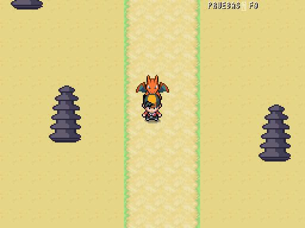
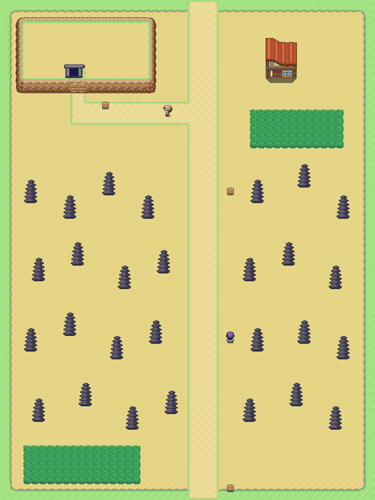
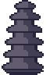

# Ruta 26 · Antequera y el Torcal · Comparativa provisional

| Referencia de ruta · Añil | Juego real · 512×384 |
|---|---|
|  |  |

48×64, norte arriba. Dólmenes al norte, Torcal al sur, con distancias comprimidas. [Plano OSM del Torcal](../../mundo/planos/ruta_26.svg), cuadrícula de 80 m. Rocas manuales 373 con estratos horizontales y repisas, colocadas en grupos irregulares con pasos entre bases; entrada adintelada 374 combinada con túmulo de terreno. Se representa la entrada de una cámara enterrada, sin recrear un círculo de piedras en superficie. Dibujo y escala provisionales, pendientes Javier.

| Caliza · 373 | Entrada de dolmen · 374 |
|---|---|
|  |  |

Fuentes primarias: [Junta de Andalucía, Torcal](https://www.juntadeandalucia.es/medioambiente/portal/web/ventanadelvisitante/detalle-buscador-mapa/-/asset_publisher/Jlbxh2qB3NwR/content/torcal-de-antequera-1/255035), [Ruta Verde y estratos de caliza](https://www.juntadeandalucia.es/medioambiente/portal/documents/20151/83339c58-224d-2a3f-5e85-4821366bf4cd), [Conjunto de los Dólmenes, UNESCO](https://whc.unesco.org/en/list/1501/). Entrada simplificada, sin identificarla como reproducción exacta de Menga/Viera. Interior pendiente de tileset. Coto Matamoros no colocado hasta aprobar su guion; guía y escaladora genéricas con clases existentes.

Encuentros Roggenrola/Carbink/Nosepass 50–53. Datos por DataDB y parcheables. Ruta 25 sur ⇄ Ruta 26 norte, columnas 24–27, offset 0. Ruta 26 sur 24–27 ⇄ Málaga norte 40–43, offsets +16/−16; llegada `from_malaga` en (25,63). Alcance norte/sur: dos puertas, todos los carteles y entrenadores accesibles, 0 problemas. Ruta 25 conserva dos puertas y ambos bordes libres. Disponible en F9.

2026-10-10: abierta la salida a Málaga, offsets +16/−16 y cuatro casillas por borde; llegadas exactas en filas 0/63.
