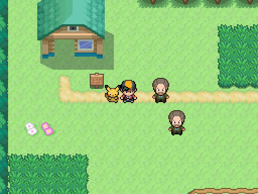
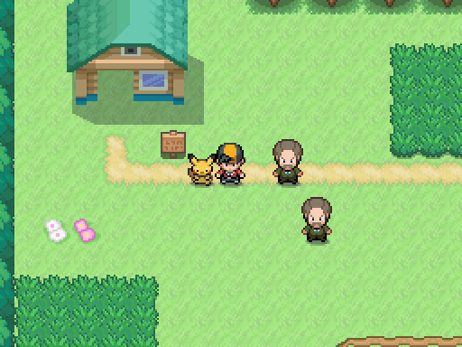

# Sombras de personajes entregadas por A4

Misma escena de Godot y sprites. A la izquierda sin sombra; a la derecha la sombra dibujada a mano por A4 (`sombra.px2` → `sombra.png`). A1 la sitúa centrada en la casilla, por debajo del personaje, sin modificarla. En saltos se queda en el suelo. Jugador, NPC, TrainerNPC y Follower la heredan.

| Antes | Integrada |
|---|---|
|  |  |

Captura: `godot --path . --rendering-method gl_compatibility --audio-driver Dummy -s maps/_tools/capture_character_shadow.gd`.
