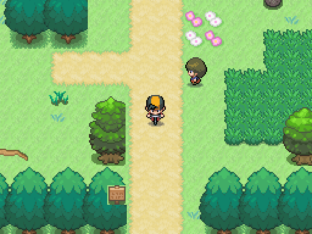
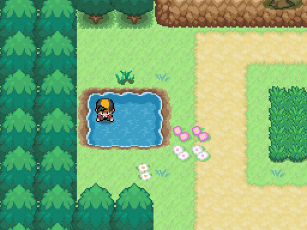
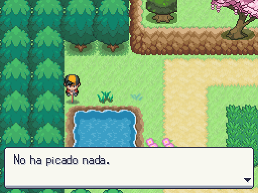

# Hojas de transporte y pesca entregadas por A4

Capturas reales de Godot en la ruta nueva, copiadas del pack 05 sin reescalar. Bicicleta requiere su objeto existente y permiso de mapa. Surf tiene su hoja integrada; el objeto/desbloqueo de historia aún no está decidido. La captura de Surf usa temporalmente la bicicleta como llave **solo en el proceso de captura**, no en world.json. Pesca muestra la hoja durante la acción y restaura la apariencia después del diálogo/antes del combate.

| Andar | Bicicleta |
|---|---|
|  |  |

| Surf (fixture de integración) | Pesca (Caña Vieja, tabla sin encuentros) |
|---|---|
|  |  |

Correr usa polvo del pack cada dos pasos; puddle usa salpicadura. El terreno puddle aún espera pintura A4, por eso no se presenta una captura de charco inventado. Tests de efectos verifican ambos disparadores. Reproducir: `godot --path . --rendering-method gl_compatibility --audio-driver Dummy -s maps/_tools/capture_transport.gd`.
