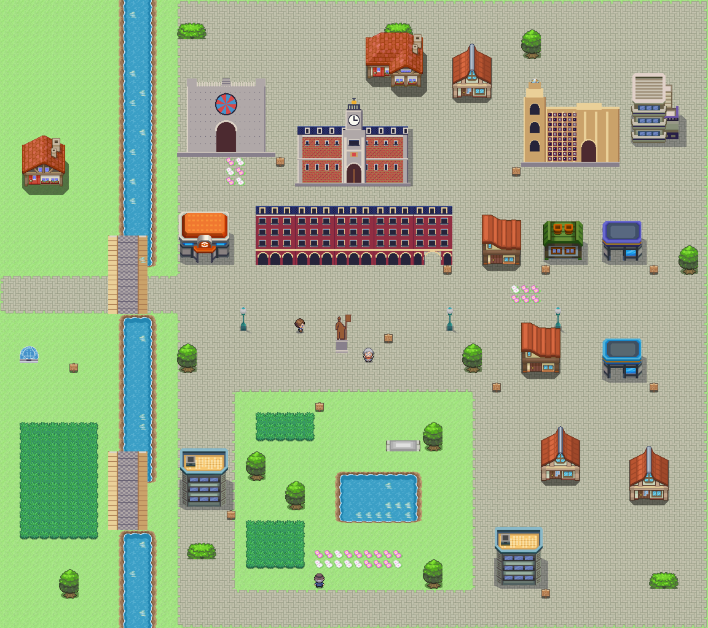
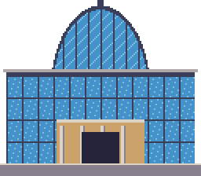
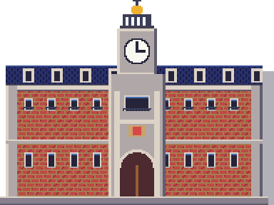
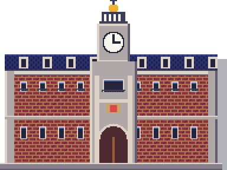
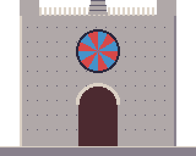
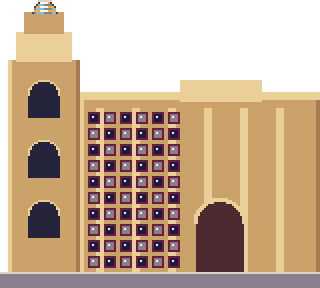
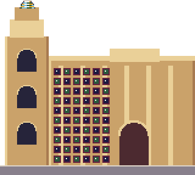

# Valladolid · Comparativa provisional

Referencia de escala y composición urbana: [Zaragoza](zaragoza_mapa.png) y [Añil](../referencias/anil_pueblo.png). Plaza Mayor porticada y espacio del gimnasio 7; Pisuerga al oeste, San Pablo al norte y Campo Grande al sur. Las adaptaciones arquitectónicas y los edificios de los packs se detallan en la [ficha](../../mundo/ciudades/valladolid.md).

| Cúpula del Milenio, nueva (fuente 352) | Palacio de Cristal del set propio |
|---|---|
|  |  |

La cúpula interpreta la estructura geodésica acristalada; ambos assets usan paleta maestra y exportación ×2. La escala compacta de la cúpula y las adaptaciones de fachadas requieren revisión. Nada aprobado todavía; sin Latasa ni otros famosos, ni interiores.

## Fachadas adaptadas y monumento

| Valladolid (nueva fuente) | Fuente propia de partida |
|---|---|
|  |  |
|  |  |
|  |  |
|  |  |

Se conservan módulos de ladrillo/galerías de los dibujos propios, se cambia el remate de San Pablo y la paleta de la catedral. Son interpretaciones compactas; no se afirma que sean reproducciones exactas ni arte final.
