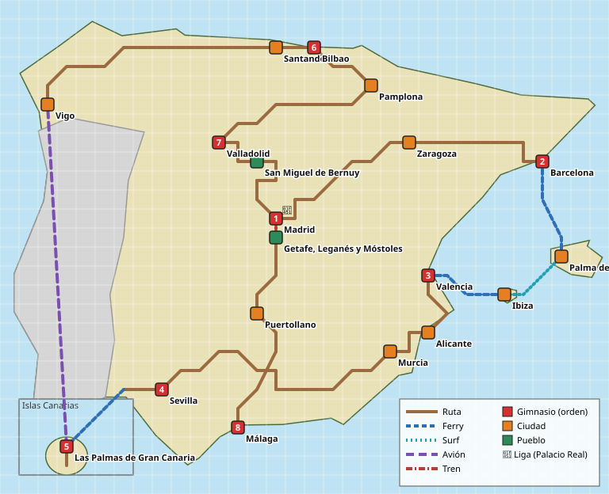

# La región: mapa y orden de la aventura

> Ciudades, gimnasios y su orden: **decisión de Javier**. Las rutas intermedias, los transportes, la curva de niveles y la trama del Clan PSOE son **propuestas** para que las apruebe o cambie.

La región es **España entera**, con las ciudades en su sitio real. El jugador sale del pueblo de Javier (San Miguel de Bernuy, Segovia), baja a Madrid y recorre la península en el orden de los gimnasios. El orden de Javier obliga a volver a Madrid al final (Málaga es el 8.º gimnasio y la Liga está en Madrid), así que el recorrido es un **gran círculo** que pasa por el pueblo de vuelta y termina bajando por La Mancha.

## Recorrido de la aventura (propuesta)

| Tramo | De → a | Por dónde (paisaje real) | Qué pasa |
|-------|--------|---------------------------|----------|
| 1 | **San Miguel de Bernuy** | — | Pueblo inicial. Casa del jugador, laboratorio, ribera del Duratón |
| 2 | → Ruta 1 → Ruta 2 | Hoces del Duratón (buitres, ermita de San Frutos) y Tierra de Pinares, junto al **Acueducto de Segovia** | Primeras capturas y el rival |
| 3 | → Ruta 3 → Ruta 4 → **Madrid** | Puerto de Navacerrada (Sierra de Guadarrama), Valle de Cuelgamuros (Franco), El Escorial, Galapagar (Pablo Iglesias e Irene Montero), entrada a Madrid por Moncloa | Primer encuentro con el **Clan PSOE** en la Moncloa |
| 4 | Madrid (gimnasio 1, **Ayuso**) | — | Ferraz, la Gran Vía, el Bernabéu, el Retiro... |
| 4b | Madrid ⇄ **Getafe, Leganés y Móstoles** | Cercanías C-5 (retrasos de Óscar Puente) | Zona opcional al principio; obligatoria al final para bajar al sur |
| 5 | Madrid → Ruta 5 → Ruta 6 → **Zaragoza** | Corredor del Henares (Alcalá, Guadalajara) y la Ruta de Medinaceli y Calatayud | El Pilar y el Ebro |
| 6 | Zaragoza → Ruta 7 → Ruta 8 → **Barcelona** | Los Monegros (desierto) y Montserrat | |
| 7 | Barcelona (gimnasio 2, **Laporta**) | — | Camp Nou en obras, Sagrada Familia... |
| 8 | Barcelona → *ferry* → **Palma de Mallorca** | Mar Balear | |
| 9 | Palma → **Surf** → **Ibiza** | Canal de Ibiza (Ruta marítima 1) | Necesita Surf (decisión de Javier) |
| 10 | Ibiza → *ferry* → **Valencia** | | |
| 11 | Valencia (gimnasio 3, **Labrador**) | — | Akuarela, en la playa de la Malvarrosa |
| 12 | Valencia → Ruta 9 → Ruta 10 → **Alicante** | La Albufera, Gandía (guiño a *Gandía Shore*) y la Costa Blanca (Benidorm) | |
| 13 | Alicante → Ruta 11 → **Murcia** | Palmeral de Elche (Vito Quiles) y la Vega Baja | |
| 14 | Murcia → Ruta 12 → Ruta 13 → **Sevilla** | Sierra Nevada y Granada (la boda de Rubiales) y el mar de olivos de Jaén y Córdoba | |
| 15 | Sevilla (gimnasio 4, **Joaquín**) | — | Giralda, Plaza de España, Triana... |
| 16 | Sevilla → Ruta 14 → Huelva → *ferry* → **Las Palmas** | Doñana; el ferry Huelva–Canarias existe de verdad | |
| 17 | Las Palmas → Ruta 15 → **Playa del Inglés** (gimnasio 5, **Quevedo**) | Costa este de Gran Canaria hasta las dunas de Maspalomas | |
| 18 | Gran Canaria → *avión* → **Vigo** | Hay vuelos directos Gran Canaria–Vigo | Luces de Navidad de Abel Caballero |
| 19 | Vigo → Ruta 16 → Ruta 17 → Ruta 18 → **Santander** | Rías Baixas (Sanxenxo: regatas del rey emérito), Galicia interior y Asturias (Picos de Europa) | |
| 20 | Santander → Ruta 19 → **Bilbao** (gimnasio 6, **la chica del *Aupa Athletic***) | Costa de Cantabria (Castro Urdiales) | San Mamés, Guggenheim |
| 21 | Bilbao → Ruta 20 → **Pamplona** | Sierra de Aralar | San Fermín |
| 22 | Pamplona → Ruta 21 → Ruta 22 → **Valladolid** (gimnasio 7, **Latasa**) | Viñedos de La Rioja y Burgos (Atapuerca) | Plaza Mayor |
| 23 | Valladolid → Ruta 23 → **San Miguel de Bernuy** | Tierra de Pinares (Cuéllar) | **Vuelta a casa**: combate contra Javier |
| 24 | San Miguel → Madrid (vuelo o AVE) → Getafe → Ruta 24 → **Puertollano** | La Mancha (molinos de Consuegra) | Complejo industrial y minas |
| 25 | Puertollano → Ruta 25 → Ruta 26 → **Málaga** (gimnasio 8, **Banderas**) | Despeñaperros (Sierra Morena) y la Ruta de Antequera (El Torcal) | |
| 26 | Málaga → AVE → Madrid → **Calle de la Victoria** → **Palacio Real** | La calle de la Victoria existe (junto a Sol): es la *Calle Victoria* del juego | Alto Mando y Líder Supremo |

### Transportes

| Transporte | Dónde | Cómo funciona (propuesta) |
|------------|-------|---------------------------|
| **Ferry** | Barcelona → Palma, Ibiza → Valencia, Huelva → Las Palmas | Escena de embarque en el puerto; pide el billete (objeto clave) |
| **Surf** | Palma → Ibiza | Como en los juegos: mar abierto con encuentros de agua (decisión de Javier) |
| **Avión** | Las Palmas → Vigo (y luego vuelo libre) | Aeropuerto con control de seguridad (chiste con los líquidos). Más tarde, Vuelo normal |
| **AVE / Cercanías** | Madrid ⇄ sur, Valladolid ⇄ Madrid, Madrid ⇄ Málaga | Viaje rápido entre estaciones ya visitadas. Siempre llega con retraso (Óscar Puente) |

### El Clan PSOE (propuesta de trama)

Imita al Team Rocket: un dúo que aparece una y otra vez, una base por zona y el jefe al final.

| Dónde | Qué |
|-------|-----|
| Moncloa (entrada a Madrid) | Primer encuentro con **Ábalos y Koldo**, el dúo fijo (los "Jessie y James" del juego) |
| Sede de **Ferraz** (Madrid) | Primera base. Se entra tras el gimnasio 1 |
| **Cloacas de Madrid** | Mazmorra de **Leire Díez, "la fontanera"** |
| Aeropuertos | El **Falcon** del Líder Supremo aparece aparcado en los aeropuertos que visitas |
| Ruta 20 (Pamplona) | Koldo en su tierra |
| Palacio Real | **Pedro Sánchez**, Líder Supremo de la Liga y jefe del Clan |

## Curva de niveles (propuesta)

| Momento | Niveles de los rivales | As del líder |
|---------|------------------------|--------------|
| Ruta 1–2 | 2–6 | — |
| Gimnasio 1, Madrid | 10–13 | 14 |
| Gimnasio 2, Barcelona | 17–20 | 21 |
| Gimnasio 3, Valencia | 23–26 | 27 |
| Gimnasio 4, Sevilla | 29–32 | 33 |
| Gimnasio 5, Las Palmas | 35–38 | 39 |
| Gimnasio 6, Bilbao | 40–43 | 44 |
| Gimnasio 7, Valladolid | 44–47 | 48 |
| Gimnasio 8, Málaga | 49–52 | 53 |
| Alto Mando | 55–59 | 60 |
| Líder Supremo | 60–63 | 65 |

## Tipos de los líderes (propuesta, PENDIENTE JAVIER)

| Líder | Tipo | Por qué | As propuesto |
|-------|------|---------|--------------|
| Ayuso | Fuego | Terrazas, cañas y "libertad"; el Madrid que no se apaga | Arcanine |
| Laporta | Acero | Palancas económicas, grúas y el estadio eternamente en obras | Copperajah |
| Labrador | Lucha | El cachas de *Gandía Shore* | Machamp |
| Joaquín | Planta | Verdiblanco del Betis | Meowscarada |
| Quevedo | Agua | Playa del Inglés y *Quédate* | Palafin |
| Chica del *Aupa Athletic* | Lucha/Fuego | Rojiblanca, como los altos hornos de Bilbao | Infernape |
| Latasa | Hielo | El frío de Valladolid | Baxcalibur |
| Banderas | Siniestro | *El Zorro* | Zoroark |
| Iniesta (Alto Mando) | Psíquico | La visión de juego | Gardevoir |
| Nadal (Alto Mando) | Tierra | El rey de la tierra batida | Garchomp |
| Gasol (Alto Mando) | Dragón | El más alto de la Liga | Dragonite |
| Alonso (Alto Mando) | Eléctrico/Acero | La Fórmula 1 y el "33" | Regieleki |
| Pedro Sánchez (Líder Supremo) | Variado | *Manual de resistencia*: aguanta lo que le echen | Kingambit |

La chica del *Aupa Athletic* repite tipo Lucha con Labrador; si Javier lo prefiere, su gimnasio puede ser de tipo Fuego puro. Los equipos completos están en [`personajes.md`](personajes.md).

## Coordenadas del mapa regional

Rejilla de **32 × 26** casillas (el norte arriba), calculada desde la latitud y longitud reales: `x = (longitud + 9,5) × 2,4`, `y = (44 − latitud) × 3`. Canarias va en un recuadro abajo a la izquierda. Están en `data/region.json` para el mapa regional y el Vuelo.

| Lugar | Tipo | x | y | Latitud, longitud reales |
|-------|------|---|---|--------------------------|
| San Miguel de Bernuy | Pueblo | 13 | 8 | 41,40, −3,93 |
| Madrid | Ciudad (gimnasio 1, Liga) | 14 | 11 | 40,42, −3,70 |
| Getafe, Leganés y Móstoles | Pueblos | 14 | 12 | 40,31, −3,75 |
| Zaragoza | Ciudad | 21 | 7 | 41,65, −0,88 |
| Barcelona | Ciudad (gimnasio 2) | 28 | 8 | 41,39, 2,17 |
| Palma de Mallorca | Ciudad | 29 | 13 | 39,57, 2,65 |
| Ibiza | Ciudad | 26 | 15 | 38,91, 1,43 |
| Valencia | Ciudad (gimnasio 3) | 22 | 14 | 39,47, −0,38 |
| Alicante | Ciudad | 22 | 17 | 38,35, −0,48 |
| Murcia | Ciudad | 20 | 18 | 37,99, −1,13 |
| Sevilla | Ciudad (gimnasio 4) | 8 | 20 | 37,39, −5,98 |
| Las Palmas de Gran Canaria | Ciudad (gimnasio 5) | 3 | 23 | 28,12, −15,43 (recuadro) |
| Vigo | Ciudad | 2 | 5 | 42,24, −8,72 |
| Santander | Ciudad | 14 | 2 | 43,46, −3,80 |
| Bilbao | Ciudad (gimnasio 6) | 16 | 2 | 43,26, −2,93 |
| Pamplona | Ciudad | 19 | 4 | 42,81, −1,64 |
| Valladolid | Ciudad (gimnasio 7) | 11 | 7 | 41,65, −4,72 |
| Puertollano | Ciudad | 13 | 16 | 38,69, −4,11 |
| Málaga | Ciudad (gimnasio 8) | 12 | 22 | 36,72, −4,42 |

Las rutas y sus casillas también están en `data/region.json` (`routes`).

## Fuentes

- [San Miguel de Bernuy (Hispanopedia)](https://es.hispanopedia.com/wiki/San_Miguel_de_Bernuy) y [Escapada Rural](https://www.escapadarural.com/que-hacer/san-miguel-de-bernuy).
- Fichas de cada ciudad en [`ciudades/`](ciudades/), con sus fuentes.
